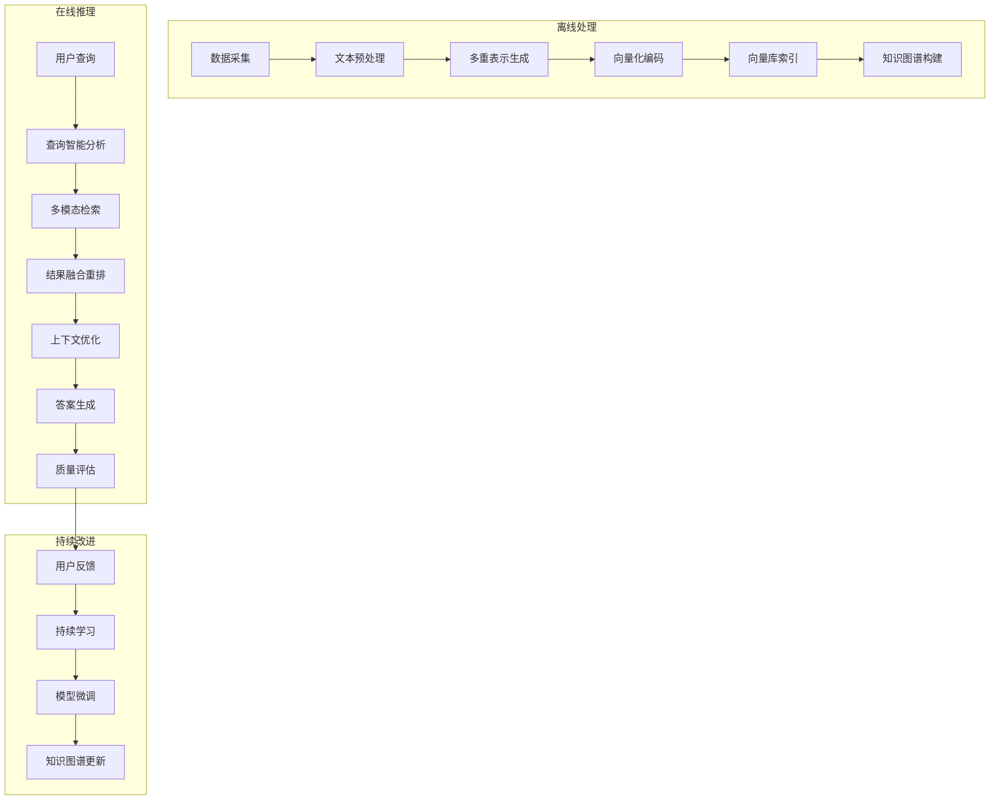

# RAG-AI 系统综合技术文档

> **RAG-AI v2.0 - 企业级检索增强生成系统完整技术说明**

本文档提供 RAG-AI 系统的完整技术实现说明，包括架构设计、核心算法、部署配置、性能优化和故障排除指南。

## 📋 目录

1. [系统概述](#1-系统概述)
2. [技术架构](#2-技术架构)
3. [核心组件详解](#3-核心组件详解)
4. [数据流与处理流程](#4-数据流与处理流程)
5. [API 接口规范](#5-api-接口规范)
6. [前端技术实现](#6-前端技术实现)
7. [部署与运维](#7-部署与运维)
8. [性能优化](#8-性能优化)
9. [安全与监控](#9-安全与监控)
10. [故障排除指南](#10-故障排除指南)

## 1. 系统概述

### 1.1 系统定位

RAG-AI 是一个专门为学术研究和技术文档设计的企业级检索增强生成系统，具备以下核心特性：

- **学术导向**：专注于 ArXiv、Hugging Face Papers、AI 研究博客等学术数据源
- **多模态检索**：结合语义搜索、关键词匹配和知识图谱增强
- **企业级架构**：微服务设计，支持水平扩展和高可用性
- **智能生成**：分层生成策略，成本与质量的最优平衡

### 1.2 技术栈概览

#### 后端技术栈
- **Python 3.10+** - 核心开发语言
- **FastAPI** - 高性能异步 Web 框架
- **Qdrant** - 向量数据库，支持混合搜索
- **Redis** - 分布式缓存和会话存储
- **SQLite** - 知识图谱和反馈数据存储
- **PyTorch/Transformers** - 深度学习模型推理

#### 前端技术栈
- **Next.js 14** - React 全栈框架
- **TypeScript** - 类型安全的 JavaScript
- **Tailwind CSS** - 现代化 CSS 框架
- **Zustand** - 轻量级状态管理
- **Server-Sent Events** - 实时流式响应

#### 部署与运维
- **Docker & Docker Compose** - 容器化部署
- **Nginx** - 反向代理和负载均衡
- **Prometheus & Grafana** - 监控和可视化
- **GitHub Actions** - CI/CD 自动化

## 2. 技术架构

### 2.1 整体架构图

```
┌─────────────────────────────────────────────────────────────────────────────────┐
│                          RAG-AI 企业级系统架构                                  │
├─────────────────────────────────────────────────────────────────────────────────┤
│  🌐 前端层 (Frontend Layer)                                                     │
│  ┌─────────────────┐  ┌─────────────────┐  ┌─────────────────┐                │
│  │ Next.js Web App │  │ Mobile App      │  │ API Dashboard   │                │
│  │ - React 组件    │  │ (Future)        │  │ - Swagger UI    │                │
│  │ - TypeScript    │  │                 │  │ - ReDoc         │                │
│  │ - Tailwind CSS  │  │                 │  │                 │                │
│  └─────────────────┘  └─────────────────┘  └─────────────────┘                │
├─────────────────────────────────────────────────────────────────────────────────┤
│  🌍 网关层 (Gateway Layer)                                                      │
│  ┌─────────────────────────────────────────────────────────────────────────────┐│
│  │ Nginx 反向代理                                                              ││
│  │ - 负载均衡         - SSL 终结          - 速率限制                          ││
│  │ - 静态资源缓存     - 请求路由          - 安全头设置                        ││
│  └─────────────────────────────────────────────────────────────────────────────┘│
├─────────────────────────────────────────────────────────────────────────────────┤
│  🔄 应用层 (Application Layer)                                                  │
│  ┌─────────────────┐  ┌─────────────────┐  ┌─────────────────┐                │
│  │ FastAPI 服务    │  │ 数据收集服务    │  │ 后台任务服务    │                │
│  │ - 异步 API      │  │ - Multi-Source  │  │ - 增量更新      │                │
│  │ - 流式响应      │  │ - PDF 处理      │  │ - 模型训练      │                │
│  │ - WebSocket     │  │ - 元数据提取    │  │ - 系统维护      │                │
│  └─────────────────┘  └─────────────────┘  └─────────────────┘                │
├─────────────────────────────────────────────────────────────────────────────────┤
│  🧠 核心服务层 (Core Services Layer)                                            │
│  ┌─────────────────┐  ┌─────────────────┐  ┌─────────────────┐                │
│  │ RAG 引擎        │  │ 检索引擎        │  │ 生成引擎        │                │
│  │ - 查询智能      │  │ - 混合搜索      │  │ - 分层生成      │                │
│  │ - Agent 执行    │  │ - 重排序        │  │ - 模型路由      │                │
│  │ - 上下文优化    │  │ - 上下文压缩    │  │ - 成本优化      │                │
│  └─────────────────┘  └─────────────────┘  └─────────────────┘                │
├─────────────────────────────────────────────────────────────────────────────────┤
│  💾 缓存层 (Caching Layer)                                                      │
│  ┌─────────────────────────────────────────────────────────────────────────────┐│
│  │ 四层缓存架构                                                                ││
│  │ L1: 内存缓存 → L2: Redis 缓存 → L3: 文件缓存 → L4: 向量缓存                ││
│  │ - LRU 策略      - 分布式存储     - 持久化存储    - 专用向量存储            ││
│  │ - 亚秒响应      - 跨实例共享     - 大数据缓存    - 语义相似性              ││
│  └─────────────────────────────────────────────────────────────────────────────┘│
├─────────────────────────────────────────────────────────────────────────────────┤
│  🗄️ 数据层 (Data Layer)                                                         │
│  ┌─────────────────┐  ┌─────────────────┐  ┌─────────────────┐                │
│  │ Qdrant 向量库   │  │ Redis 内存库    │  │ SQLite 关系库   │                │
│  │ - 向量存储      │  │ - 会话数据      │  │ - 知识图谱      │                │
│  │ - 混合搜索      │  │ - 缓存数据      │  │ - 用户反馈      │                │
│  │ - 元数据过滤    │  │ - 实时状态      │  │ - 系统配置      │                │
│  └─────────────────┘  └─────────────────┘  └─────────────────┘                │
├─────────────────────────────────────────────────────────────────────────────────┤
│  📊 监控层 (Monitoring Layer)                                                   │
│  ┌─────────────────┐  ┌─────────────────┐  ┌─────────────────┐                │
│  │ Prometheus      │  │ Grafana         │  │ 日志聚合        │                │
│  │ - 指标收集      │  │ - 可视化面板    │  │ - 结构化日志    │                │
│  │ - 告警规则      │  │ - 实时监控      │  │ - 错误追踪      │                │
│  │ - 时序存储      │  │ - 性能分析      │  │ - 审计日志      │                │
│  └─────────────────┘  └─────────────────┘  └─────────────────┘                │
└─────────────────────────────────────────────────────────────────────────────────┘
```

### 2.2 服务间通信

```
┌─────────────────────────────────────────────────────────────────┐
│                    服务间通信架构                                │
├─────────────────────────────────────────────────────────────────┤
│                                                                 │
│  Frontend ──HTTP/WebSocket──→ Nginx ──HTTP──→ FastAPI          │
│     │                           │                 │            │
│     │                           │                 ▼            │
│     │                           └──Static──→ File System       │
│     │                                             │            │
│     ▼                                             ▼            │
│  Browser Storage                           ┌─────────────────┐  │
│                                           │  RAG 核心引擎   │  │
│                                           │  ┌─────────────┐│  │
│                                           │  │ 查询处理器  ││  │
│                                           │  └─────────────┘│  │
│                                           │  ┌─────────────┐│  │
│                                           │  │ 检索引擎    ││  │
│                                           │  └─────────────┘│  │
│                                           │  ┌─────────────┐│  │
│                                           │  │ 生成引擎    ││  │
│                                           │  └─────────────┘│  │
│                                           └─────────────────┘  │
│                                                     │          │
│                              ┌─────────────────────┼──────────┐│
│                              │                     ▼          ││
│                              │              ┌─────────────────┐││
│                              │              │  存储层         │││
│                              │              │  ┌─────────────┐│││
│                              │              │  │ Qdrant DB   ││││
│                              │              │  └─────────────┘│││
│                              │              │  ┌─────────────┐│││
│                              │              │  │ Redis Cache ││││
│                              │              │  └─────────────┘│││
│                              │              │  ┌─────────────┐│││
│                              │              │  │ SQLite DB   ││││
│                              │              │  └─────────────┘│││
│                              │              └─────────────────┘││
│                              │                                 ││
│                              │ 监控 & 日志                     ││
│                              │ ┌─────────────┐ ┌─────────────┐ ││
│                              │ │ Prometheus  │ │ Grafana     │ ││
│                              │ └─────────────┘ └─────────────┘ ││
│                              └─────────────────────────────────┘│
└─────────────────────────────────────────────────────────────────┘
```

## 3. 核心组件详解

### 3.1 数据采集组件 (Data Ingestion)

#### MultiSourceCollector

**位置**: `src/data_ingestion/multi_source_collector.py`

**核心功能**:
- **元数据优先策略**: 优先收集论文元数据，按需获取全文
- **多源异步采集**: 同时处理 ArXiv、Hugging Face、技术博客
- **增量更新机制**: 每日增量更新，避免重复处理
- **智能引用生成**: 自动生成多种学术引用格式

**技术实现**:
```python
class MultiSourceCollector:
    def __init__(self, data_dir: Path, metadata_only: bool = True):
        self.metadata_only = metadata_only
        self.citation_manager = CitationManager(data_dir)
        
    async def collect_all(self, days_back: int = 7) -> Dict[str, Any]:
        """异步收集所有数据源"""
        tasks = [
            self.fetch_arxiv_papers(days_back),
            self.fetch_huggingface_papers(days_back),
            self.fetch_blog_posts(days_back)
        ]
        results = await asyncio.gather(*tasks, return_exceptions=True)
        return self._merge_results(results)
    
    async def fetch_full_text_on_demand(self, doc_id: str) -> str:
        """按需获取全文，避免存储浪费"""
        if self.is_cached(doc_id):
            return self.load_from_cache(doc_id)
        
        full_text = await self._download_and_process_pdf(doc_id)
        self.cache_full_text(doc_id, full_text)
        return full_text
```

**配置参数**:
```python
# .env 配置
ARXIV_API_URL=http://export.arxiv.org/api/query
HUGGING_FACE_TOKEN=your_token_here
MAX_CONCURRENT_DOWNLOADS=5
PDF_PROCESSING_TIMEOUT=60
ENABLE_FULL_TEXT_EXTRACTION=true
```

#### 引用管理系统

**位置**: `src/citation/citation_manager.py`

**核心功能**:
- 支持 APA、MLA、BibTeX、IEEE、Chicago 格式
- 自动链接验证和可访问性检查
- 引用使用统计和趋势分析
- 批量导出和参考文献生成

**技术实现**:
```python
class CitationManager:
    def generate_citation(self, source_id: str, format_type: str) -> str:
        """生成指定格式的引用"""
        source = self.get_source(source_id)
        formatter = self.get_formatter(format_type)
        return formatter.format(source)
    
    def generate_source_links(self, source_id: str) -> Dict[str, str]:
        """生成多种访问链接"""
        return {
            "pdf": self._get_pdf_link(source_id),
            "arxiv": self._get_arxiv_link(source_id),
            "doi": self._get_doi_link(source_id),
            "citation": self._get_citation_link(source_id)
        }
```

### 3.2 文本处理组件 (Text Processing)

#### HierarchicalTextSplitter

**位置**: `src/processing/text_processor.py`

**核心功能**:
- 智能章节识别和分割
- 递归文本分块，保持语义完整性
- 多语言支持（中英文优化）
- 元数据保留和传递

**技术实现**:
```python
class HierarchicalTextSplitter:
    def __init__(self, 
                 chunk_size: int = 1000,
                 chunk_overlap: int = 200,
                 separators: List[str] = None):
        self.chunk_size = chunk_size
        self.chunk_overlap = chunk_overlap
        self.separators = separators or ["\n\n", "\n", "。", ".", " "]
    
    def split_text(self, text: str, metadata: Dict = None) -> List[TextChunk]:
        """层次化文本分割"""
        # 1. 章节级别分割
        sections = self._split_by_sections(text)
        
        # 2. 段落级别分割  
        chunks = []
        for section in sections:
            section_chunks = self._recursive_split(section)
            chunks.extend(section_chunks)
            
        # 3. 添加元数据和 chunk_id
        for i, chunk in enumerate(chunks):
            chunk.metadata = {**metadata, "chunk_index": i}
            chunk.chunk_id = self._generate_chunk_id(chunk)
            
        return chunks
```

#### SemanticGraphSplitter（新增）

**位置**: `src/processing/text_processor.py`

**核心思路**:
- 通过共享的 `MultilingualEmbedder` 对句子编码
- 以动态缓冲区累积句子，使用余弦相似度、长度、句数多重条件控制切分
- 支持配置参数：`semantic_similarity_threshold`、`semantic_max_sentences`
- 配置项 `splitter_type=semantic` 可切换至该策略

**优势**:
- chunk 边界更贴合语义，降低跨 chunk 信息丢失
- 对长篇论文、技术报告等结构复杂文本表现优于固定窗口
- 为后续检索与生成提供更一致的上下文

#### MultiRepresentationIndexer

**位置**: `src/processing/multi_representation_indexer.py`

**核心功能**:
- 生成原文、摘要、假设问题的多重表示
- 异步批量处理，提高效率
- 语义类型标注，便于检索优化
- 自适应压缩和质量控制

**最新增强**:
- **批量推理**：摘要/问题生成改为批处理，`multi_rep_batch_size` 控制 GPU 吞吐
- **摘要压缩**：`SummaryCompressor` 去除冗余句子，保留核心信息
- **问题过滤**：`QuestionQualityFilter` 根据语言与 token 重叠筛选问题，提供兜底模板
- **进度追踪优化**：避免异步任务 completing out-of-order 造成进度倒退

### 3.3 检索引擎 (Retrieval Engine)

#### VectorDatabaseManager & QdrantVectorDB

**位置**: `src/retrieval/vector_database.py`

**核心功能**:
- 混合搜索：语义相似度 + BM25 + 元数据过滤
- 中文分词优化：1-3 字滑窗分词
- 学术搜索增强：作者、年份、期刊过滤
- 性能监控：检索延迟和成功率统计

**技术实现**:
```python
class QdrantVectorDB:
    async def advanced_academic_search(self,
                                     query_vector: np.ndarray,
                                     query_text: str,
                                     authors: List[str] = None,
                                     year_range: Tuple[int, int] = None,
                                     sources: List[str] = None,
                                     categories: List[str] = None,
                                     top_k: int = 10) -> List[Dict]:
        """学术增强搜索"""
        # 构建过滤条件
        filters = self._build_academic_filters(
            authors, year_range, sources, categories
        )
        
        # 执行混合搜索
        vector_results = await self._vector_search(query_vector, top_k, filters)
        text_results = await self._text_search(query_text, top_k, filters)
        
        # 结果融合和重排序
        return self._fuse_and_rerank(vector_results, text_results, query_text)
```

#### QueryIntelligenceEngine

**位置**: `src/retrieval/query_intelligence.py`

**核心功能**:
- 查询复杂度分析和类型识别
- 自动查询重写和扩展
- 子问题分解和 HyDE 文档生成
- 多语言查询处理
- 共享句向量模型 `embedder` 供检索与生成阶段复用

**技术实现**:
```python
class QueryIntelligenceEngine:
    async def analyze_query(self, query: str) -> QueryAnalysisResult:
        """智能查询分析"""
        analysis = {
            "language": self._detect_language(query),
            "complexity": self._analyze_complexity(query),
            "query_type": self._classify_query_type(query),
            "entities": await self._extract_entities(query),
            "intent": await self._classify_intent(query)
        }
        return QueryAnalysisResult(**analysis)
    
    async def get_optimized_queries(self, query: str) -> List[str]:
        """生成优化查询变体"""
        base_rewrites = await self._rewrite_query(query)
        sub_questions = await self._generate_sub_questions(query)
        return self._deduplicate_queries(base_rewrites + sub_questions)
```

#### HybridRetriever

**位置**: `src/retrieval/hybrid_retriever.py`

**核心功能**:
- 并行多模态检索：向量搜索 + BM25 + 知识图谱
- 智能结果融合：权重调节和分数归一化
- 检索元数据追踪：来源、置信度、质量评估
- 自适应检索策略：根据查询类型调整权重

**改进亮点**:
- 移除 `asyncio.run` 嵌套，兼容上层 async 框架
- BM25 支持 `jieba` 分词，更适配中文文本
- 知识图谱检索返回实体、路径、原始 chunk 等结构化元数据

### 3.4 缓存系统 (Caching System)

#### MultiLayerCache

**位置**: `src/caching/multilayer_cache.py`

**核心架构**:
```
L1: 内存缓存 (Memory Cache)
├─ LRU 淘汰策略
├─ 毫秒级响应时间
└─ 热点数据存储

L2: Redis 缓存 (Distributed Cache)  
├─ 跨实例数据共享
├─ 持久化选项
└─ 分布式一致性

L3: 文件缓存 (File Cache)
├─ 大数据对象存储
├─ 压缩和序列化
└─ 磁盘持久化

L4: 向量缓存 (Vector Cache)
├─ 专用向量存储
├─ 语义相似性检索
└─ 高维数据优化
```

**技术实现**:
```python
class MultiLayerCache:
    def __init__(self, config: CacheConfig):
        self.l1_memory = MemoryCache(config.memory_size)
        self.l2_redis = RedisCache(config.redis_url)
        self.l3_file = FileCache(config.file_cache_dir)
        self.l4_vector = VectorCache(config.vector_cache_dir)
    
    async def get(self, key: str, cache_type: str = 'auto') -> Any:
        """智能缓存查询"""
        # L1: 内存缓存
        if result := await self.l1_memory.get(key):
            await self._promote_to_l1(key, result)
            return result
            
        # L2: Redis 缓存
        if result := await self.l2_redis.get(key):
            await self.l1_memory.set(key, result)
            return result
            
        # L3: 文件缓存
        if result := await self.l3_file.get(key):
            await self.l2_redis.set(key, result)
            await self.l1_memory.set(key, result)
            return result
            
        return None
```

### 3.5 生成引擎 (Generation Engine)

#### TieredGenerationSystem

**位置**: `src/generation/tiered_generation.py`

**核心功能**:
- 智能模型路由：根据任务复杂度选择最优模型
- 成本效率优化：本地模型优先，API 模型补充
- 质量控制：多轮验证和自我评估
- 性能监控：延迟、成本、成功率追踪

**技术实现**:
```python
class TieredGenerationSystem:
    def __init__(self, config: Dict[str, Any]):
        self.task_router = TaskRouter(config)
        self.cost_optimizer = CostOptimizer(config)
        self.performance_monitor = PerformanceMonitor()
        
    async def execute_task(self, task: TaskRequest) -> TaskResponse:
        """执行分层生成任务"""
        # 1. 任务路由
        model_choice = await self.task_router.route_task(task)
        
        # 2. 成本预估
        estimated_cost = self.cost_optimizer.estimate_cost(task, model_choice)
        
        # 3. 执行生成
        start_time = time.time()
        try:
            if model_choice.is_local:
                result = await self._execute_local_task(task, model_choice)
            else:
                result = await self._execute_api_task(task, model_choice)
                
            # 4. 性能记录
            execution_time = time.time() - start_time
            self.performance_monitor.record_task(
                task_type=task.task_type,
                model=model_choice.model_name,
                execution_time=execution_time,
                cost=estimated_cost,
                success=True
            )
            
            return TaskResponse(
                result=result,
                model_used=model_choice.model_name,
                execution_time=execution_time,
                estimated_cost=estimated_cost
            )
            
        except Exception as e:
            self.performance_monitor.record_task(
                task_type=task.task_type,
                model=model_choice.model_name,
                execution_time=time.time() - start_time,
                success=False,
                error=str(e)
            )
            raise
```

#### AgenticRAGOrchestrator

**位置**: `src/retrieval/agentic_rag.py`

**核心功能**:
- 自评估检索质量：置信度分析和结果验证
- 自适应查询改写：基于检索结果的迭代优化
- 多轮检索决策：Proceed/Retry/Expand/SeekMore 策略
- 检索过程追踪：每轮决策和改进记录

## 4. 数据流与处理流程

### 4.1 数据处理管道



### 4.2 详细数据流程

#### 4.2.1 数据采集流程

```python
async def data_collection_pipeline():
    """数据采集管道"""
    # 步骤 1: 多源数据采集
    collector = MultiSourceCollector(data_dir, metadata_only=True)
    raw_data = await collector.collect_all(days_back=7)
    
    # 步骤 2: 数据清洗和验证
    cleaned_data = await data_cleaner.clean_and_validate(raw_data)
    
    # 步骤 3: 元数据提取和增强
    enhanced_data = await metadata_enhancer.enhance_metadata(cleaned_data)
    
    # 步骤 4: 引用信息生成
    citation_data = await citation_manager.generate_citations(enhanced_data)
    
    # 步骤 5: 存储到原始数据库
    await storage_manager.store_raw_data(citation_data)
    
    return citation_data
```

#### 4.2.2 文本处理流程

```python
async def text_processing_pipeline(raw_documents: List[Dict]):
    """文本处理管道"""
    processed_chunks = []
    
    for doc in raw_documents:
        # 步骤 1: 文本提取和清洗
        clean_text = text_cleaner.clean(doc['content'])
        
        # 步骤 2: 层次化分割
        chunks = text_splitter.split_text(clean_text, doc['metadata'])
        
        # 步骤 3: 多重表示生成（可选）
        if config.ENABLE_MULTI_REPRESENTATION:
            chunks = await multi_rep_indexer.generate_representations(chunks)
        
        # 步骤 4: 向量编码
        for chunk in chunks:
            chunk.embedding = await embedder.encode(chunk.content)
            
        processed_chunks.extend(chunks)
    
    return processed_chunks
```

#### 4.2.3 检索和生成流程

```python
async def rag_inference_pipeline(user_query: str) -> GenerationResult:
    """RAG 推理管道"""
    # 步骤 1: 查询智能分析
    query_analysis = await query_engine.analyze_query(user_query)
    optimized_queries = await query_engine.get_optimized_queries(user_query)
    
    # 步骤 2: 多模态检索
    all_results = []
    for query in optimized_queries[:3]:  # 限制查询数量
        query_vector = await embedder.encode(query)
        results = await retriever.search(query_vector, query, top_k=10)
        all_results.extend(results)
    
    # 步骤 3: HyDE 检索（可选）
    if query_analysis.hyde_document:
        hyde_vector = await embedder.encode(query_analysis.hyde_document)
        hyde_results = await retriever.search(hyde_vector, top_k=5)
        all_results.extend(hyde_results)
    
    # 步骤 4: 结果去重和融合
    unique_results = await deduplicator.deduplicate(all_results)
    
    # 步骤 5: 重排序和上下文优化
    reranked_results = await reranker.rerank(user_query, unique_results)
    optimized_context = await context_optimizer.optimize(reranked_results)
    
    # 步骤 6: 答案生成
    if config.ENABLE_AGENTIC_RAG:
        answer = await agentic_orchestrator.generate_answer(
            user_query, optimized_context
        )
    else:
        answer = await generator.generate_answer(user_query, optimized_context)
    
    # 步骤 7: 结果包装和返回
    return GenerationResult(
        answer=answer,
        source_chunks=reranked_results,
        query_analysis=query_analysis,
        generation_metadata=generator.get_metadata()
    )
```

## 5. API 接口规范

### 5.1 FastAPI 后端接口

#### 5.1.1 核心问答接口

```python
@app.post("/ask", response_model=QueryResponse)
async def ask_question(request: QueryRequest) -> QueryResponse:
    """主要问答接口"""
    try:
        result = await rag_system.generate_answer(
            user_query=request.query,
            max_results=request.max_results or 5,
            include_sources=request.include_sources or True,
            rag_mode=request.rag_mode or "ultimate"
        )
        
        return QueryResponse(
            answer=result.answer,
            sources=result.source_chunks,
            confidence=result.confidence,
            processing_time=result.generation_time,
            query_id=str(uuid.uuid4()),
            cached=False  # 根据实际缓存状态设置
        )
    except Exception as e:
        logger.error(f"Error in ask_question: {e}")
        raise HTTPException(status_code=500, detail=str(e))
```

#### 5.1.2 流式响应接口

```python
@app.post("/ask/stream")
async def ask_question_stream(request: QueryRequest):
    """流式问答接口"""
    async def generate():
        try:
            yield f"data: {json.dumps({'type': 'start', 'query_id': str(uuid.uuid4())})}\n\n"
            
            async for chunk in rag_system.generate_answer_stream(
                user_query=request.query,
                **request.dict(exclude={'query'})
            ):
                if chunk.type == 'content':
                    yield f"data: {json.dumps({'type': 'content', 'content': chunk.content})}\n\n"
                elif chunk.type == 'sources':
                    yield f"data: {json.dumps({'type': 'sources', 'sources': chunk.sources})}\n\n"
                    
            yield f"data: {json.dumps({'type': 'complete'})}\n\n"
            
        except Exception as e:
            yield f"data: {json.dumps({'type': 'error', 'error': str(e)})}\n\n"
    
    return StreamingResponse(generate(), media_type="text/plain")
```

#### 5.1.3 文档搜索接口

```python
@app.post("/search", response_model=SearchResponse)
async def search_documents(request: SearchRequest) -> SearchResponse:
    """文档搜索接口"""
    try:
        # 构建搜索参数
        search_params = {
            "query_text": request.query,
            "top_k": request.limit or 20,
            "offset": request.offset or 0,
            "search_type": request.search_type or "hybrid"
        }
        
        # 添加过滤条件
        if request.filters:
            search_params.update({
                "authors": request.filters.authors,
                "year_range": request.filters.year_range,
                "sources": request.filters.sources,
                "categories": request.filters.categories,
                "has_full_text": request.filters.has_full_text
            })
        
        # 执行搜索
        results = await search_engine.advanced_search(**search_params)
        
        return SearchResponse(
            results=results,
            total=len(results),
            offset=request.offset or 0,
            cached=False
        )
        
    except Exception as e:
        logger.error(f"Error in search_documents: {e}")
        raise HTTPException(status_code=500, detail=str(e))
```

### 5.2 系统管理接口

#### 5.2.1 系统状态接口

```python
@app.get("/health")
async def health_check():
    """系统健康检查"""
    health_status = {
        "status": "healthy",
        "timestamp": datetime.now().isoformat(),
        "version": "2.0.0",
        "components": {}
    }
    
    # 检查各组件状态
    try:
        # Qdrant 连接检查
        qdrant_status = await vector_db.health_check()
        health_status["components"]["qdrant"] = qdrant_status
        
        # Redis 连接检查
        redis_status = await cache_manager.health_check()
        health_status["components"]["redis"] = redis_status
        
        # 模型加载检查
        model_status = model_registry.health_check()
        health_status["components"]["models"] = model_status
        
        # 确定整体状态
        if all(status for status in health_status["components"].values()):
            health_status["status"] = "healthy"
        else:
            health_status["status"] = "warning"
            
    except Exception as e:
        health_status["status"] = "critical"
        health_status["error"] = str(e)
    
    return health_status
```

#### 5.2.2 系统统计接口

```python
@app.get("/stats", response_model=SystemStats)
async def get_system_stats() -> SystemStats:
    """获取系统统计信息"""
    try:
        # 缓存统计
        cache_stats = await cache_manager.get_stats()
        
        # 引用统计
        citation_stats = await citation_manager.get_stats()
        
        # 反馈统计
        feedback_stats = await feedback_collector.get_stats()
        
        return SystemStats(
            cache=cache_stats,
            citations=citation_stats,
            feedback=feedback_stats,
            timestamp=datetime.now().isoformat()
        )
        
    except Exception as e:
        logger.error(f"Error getting system stats: {e}")
        raise HTTPException(status_code=500, detail=str(e))
```

### 5.3 前端 API 客户端

#### 5.3.1 TypeScript API 客户端

```typescript
class ApiClient {
    private client: AxiosInstance;
    
    constructor() {
        this.client = axios.create({
            baseURL: process.env.NEXT_PUBLIC_API_URL || 'http://localhost:8000',
            timeout: 30000,
            headers: {
                'Content-Type': 'application/json',
            },
        });
        
        // 请求拦截器
        this.client.interceptors.request.use(
            (config) => {
                const token = localStorage.getItem('auth_token');
                if (token) {
                    config.headers.Authorization = `Bearer ${token}`;
                }
                return config;
            },
            (error) => Promise.reject(error)
        );
        
        // 响应拦截器
        this.client.interceptors.response.use(
            (response) => response,
            (error) => {
                console.error('API Error:', error);
                return Promise.reject(error);
            }
        );
    }
    
    // 流式问答
    async *askQuestionStream(request: QueryRequest): AsyncGenerator<StreamChunk> {
        const url = `${this.baseURL}/ask/stream`;
        
        try {
            const response = await fetch(url, {
                method: 'POST',
                headers: {
                    'Content-Type': 'application/json',
                },
                body: JSON.stringify(request),
            });

            if (!response.ok) {
                throw new Error(`HTTP error! status: ${response.status}`);
            }

            const reader = response.body?.getReader();
            const decoder = new TextDecoder();

            while (true) {
                const { done, value } = await reader.read();
                
                if (done) break;

                const chunk = decoder.decode(value);
                const lines = chunk.split('\n');

                for (const line of lines) {
                    if (line.startsWith('data: ')) {
                        try {
                            const data = JSON.parse(line.slice(6));
                            yield data as StreamChunk;
                        } catch (e) {
                            console.warn('Failed to parse SSE data:', line);
                        }
                    }
                }
            }
        } catch (error) {
            console.error('Streaming error:', error);
            yield {
                type: 'error',
                error: error instanceof Error ? error.message : 'Unknown error',
            };
        }
    }
}
```

## 6. 前端技术实现

### 6.1 Next.js 架构设计

#### 6.1.1 应用结构

```
frontend/src/
├── app/                    # Next.js 13+ App Router
│   ├── layout.tsx         # 根布局组件
│   ├── page.tsx          # 主页面
│   └── globals.css       # 全局样式
├── components/            # React 组件
│   ├── layout/           # 布局组件
│   │   ├── MainLayout.tsx
│   │   ├── Header.tsx
│   │   └── Sidebar.tsx
│   ├── chat/            # 聊天相关组件
│   │   └── ChatInterface.tsx
│   ├── search/          # 搜索相关组件
│   │   └── SearchInterface.tsx
│   ├── dashboard/       # 监控面板组件
│   │   └── DashboardInterface.tsx
│   └── ui/              # 基础 UI 组件
│       ├── Button.tsx
│       └── Loading.tsx
├── lib/                 # 工具库
│   ├── api.ts          # API 客户端
│   └── utils.ts        # 工具函数
├── store/              # 状态管理
│   └── useAppStore.ts  # Zustand 全局状态
└── types/              # TypeScript 类型定义
    └── index.ts
```

#### 6.1.2 状态管理设计

```typescript
interface AppStore extends AppState {
    // Chat actions
    createSession: () => ChatSession;
    setCurrentSession: (session: ChatSession | null) => void;
    addMessage: (sessionId: string, message: Omit<Message, 'id' | 'timestamp'>) => void;
    updateMessage: (sessionId: string, messageId: string, updates: Partial<Message>) => void;
    deleteSession: (sessionId: string) => void;
    clearAllSessions: () => void;
    setIsTyping: (typing: boolean) => void;

    // Search actions
    setSearchResults: (results: Document[]) => void;
    setSearchLoading: (loading: boolean) => void;
    setTrendingPapers: (papers: TrendingPaper[]) => void;

    // System actions
    setSystemStats: (stats: SystemStats) => void;
    setHealthStatus: (status: 'healthy' | 'warning' | 'critical' | 'unknown') => void;

    // User actions
    updatePreferences: (preferences: Partial<UserPreferences>) => void;

    // UI actions
    setSidebarOpen: (open: boolean) => void;
    setCurrentView: (view: 'chat' | 'search' | 'trending' | 'dashboard') => void;
    toggleSidebar: () => void;
}

export const useAppStore = create<AppStore>()(
    persist(
        (set, get) => ({
            // Initial state
            currentSession: null,
            sessions: [],
            isTyping: false,
            searchResults: [],
            searchLoading: false,
            trendingPapers: [],
            systemStats: null,
            healthStatus: 'unknown',
            preferences: defaultPreferences,
            sidebarOpen: true,
            currentView: 'chat',

            // Implementation of actions...
        }),
        {
            name: 'rag-ai-store',
            partialize: (state) => ({
                sessions: state.sessions,
                preferences: state.preferences,
                sidebarOpen: state.sidebarOpen,
                currentView: state.currentView,
            }),
        }
    )
);
```

### 6.2 实时通信实现

#### 6.2.1 Server-Sent Events 流式响应

```typescript
// 前端流式处理
const handleSubmit = async (e?: React.FormEvent) => {
    e?.preventDefault();
    
    if (!input.trim() || !currentSession || isStreaming) return;

    // 添加用户消息
    addMessage(currentSession.id, {
        content: input.trim(),
        role: 'user',
    });

    setInput('');
    setIsStreaming(true);
    setIsTyping(true);

    try {
        // 创建临时助手消息
        const assistantMessageId = `temp-${Date.now()}`;
        addMessage(currentSession.id, {
            content: '',
            role: 'assistant',
            sources: [],
        });

        // 开始流式处理
        const stream = apiClient.askQuestionStream({
            query: input.trim(),
            max_results: preferences.maxResults,
            include_sources: preferences.includeSources,
            rag_mode: preferences.defaultRAGMode as any,
            stream_response: true,
        });

        let accumulatedContent = '';
        let sources: Source[] = [];

        for await (const chunk of stream) {
            if (chunk.type === 'content' && chunk.content) {
                accumulatedContent += chunk.content;
                updateMessage(currentSession.id, assistantMessageId, {
                    content: accumulatedContent,
                });
            } else if (chunk.type === 'sources' && chunk.sources) {
                sources = chunk.sources;
                updateMessage(currentSession.id, assistantMessageId, {
                    sources: sources,
                });
            } else if (chunk.type === 'error') {
                updateMessage(currentSession.id, assistantMessageId, {
                    content: `错误: ${chunk.error}`,
                });
                break;
            }
        }
    } catch (error) {
        console.error('Chat error:', error);
        // 错误处理...
    } finally {
        setIsStreaming(false);
        setIsTyping(false);
    }
};
```

### 6.3 响应式设计实现

#### 6.3.1 Tailwind CSS 配置

```typescript
// tailwind.config.ts
import type { Config } from 'tailwindcss';

const config: Config = {
    content: [
        './src/pages/**/*.{js,ts,jsx,tsx,mdx}',
        './src/components/**/*.{js,ts,jsx,tsx,mdx}',
        './src/app/**/*.{js,ts,jsx,tsx,mdx}',
    ],
    theme: {
        extend: {
            colors: {
                border: 'hsl(var(--border))',
                input: 'hsl(var(--input))',
                ring: 'hsl(var(--ring))',
                background: 'hsl(var(--background))',
                foreground: 'hsl(var(--foreground))',
                primary: {
                    DEFAULT: 'hsl(var(--primary))',
                    foreground: 'hsl(var(--primary-foreground))',
                },
                secondary: {
                    DEFAULT: 'hsl(var(--secondary))',
                    foreground: 'hsl(var(--secondary-foreground))',
                },
                // ... 更多颜色定义
            },
            screens: {
                'xs': '475px',
                '3xl': '1600px',
            },
            animation: {
                'fade-in': 'fadeIn 0.2s ease-out',
                'pulse-slow': 'pulse-slow 2s cubic-bezier(0.4, 0, 0.6, 1) infinite',
            },
        },
    },
    plugins: [],
};

export default config;
```

#### 6.3.2 移动端适配

```tsx
// 移动端导航组件
export default function MobileNavigation() {
    const { currentView, setCurrentView } = useAppStore();

    const navigationItems = [
        { id: 'chat', label: '对话', icon: MessageSquare },
        { id: 'search', label: '搜索', icon: Search },
        { id: 'trending', label: '热门', icon: TrendingUp },
        { id: 'dashboard', label: '监控', icon: BarChart3 },
    ];

    return (
        <div className="md:hidden fixed bottom-0 left-0 right-0 bg-card border-t border-border p-2 z-50">
            <div className="flex justify-around">
                {navigationItems.map((item) => {
                    const Icon = item.icon;
                    return (
                        <Button
                            key={item.id}
                            variant={currentView === item.id ? "default" : "ghost"}
                            size="sm"
                            onClick={() => setCurrentView(item.id as any)}
                            className="flex-1 gap-2 py-3 text-xs"
                        >
                            <Icon className="h-4 w-4" />
                            {item.label}
                        </Button>
                    );
                })}
            </div>
        </div>
    );
}
```

## 7. 部署与运维

### 7.1 Docker 容器化部署

#### 7.1.1 生产环境 Docker Compose

```yaml
# docker-compose.yml
version: '3.8'

services:
  # Qdrant 向量数据库
  qdrant:
    image: qdrant/qdrant:v1.7.0
    container_name: rag-ai-qdrant
    restart: unless-stopped
    ports:
      - "6333:6333"
      - "6334:6334"
    volumes:
      - qdrant_storage:/qdrant/storage
    environment:
      - QDRANT__SERVICE__HTTP_PORT=6333
      - QDRANT__SERVICE__GRPC_PORT=6334
      - QDRANT__LOG_LEVEL=INFO
    healthcheck:
      test: ["CMD", "curl", "-f", "http://localhost:6333/health"]
      interval: 30s
      timeout: 10s
      retries: 5
    networks:
      - rag-ai-network

  # Redis 缓存
  redis:
    image: redis:7.2-alpine
    container_name: rag-ai-redis
    restart: unless-stopped
    ports:
      - "6379:6379"
    volumes:
      - redis_data:/data
    command: redis-server --appendonly yes --maxmemory 512mb --maxmemory-policy allkeys-lru
    healthcheck:
      test: ["CMD", "redis-cli", "ping"]
      interval: 30s
      timeout: 10s
      retries: 5
    networks:
      - rag-ai-network

  # FastAPI 后端
  api:
    build:
      context: .
      dockerfile: Dockerfile.api
    container_name: rag-ai-api
    restart: unless-stopped
    ports:
      - "8000:8000"
    volumes:
      - ./configs:/app/configs
      - ./data:/app/data
      - ./logs:/app/logs
      - model_cache:/app/models
    environment:
      - QDRANT_HOST=qdrant
      - QDRANT_PORT=6333
      - REDIS_HOST=redis
      - REDIS_PORT=6379
      - STORAGE_ROOT=/app/data
      - HF_HOME=/app/models
      - PYTHONPATH=/app
    depends_on:
      qdrant:
        condition: service_healthy
      redis:
        condition: service_healthy
    healthcheck:
      test: ["CMD", "curl", "-f", "http://localhost:8000/health"]
      interval: 30s
      timeout: 10s
      retries: 5
    networks:
      - rag-ai-network

  # Next.js 前端
  frontend:
    build:
      context: ./frontend
      dockerfile: Dockerfile
    container_name: rag-ai-frontend
    restart: unless-stopped
    ports:
      - "3000:3000"
    environment:
      - NEXT_PUBLIC_API_URL=http://localhost:8000
      - NEXT_PUBLIC_WS_URL=ws://localhost:8000
      - NODE_ENV=production
    depends_on:
      api:
        condition: service_healthy
    healthcheck:
      test: ["CMD", "wget", "--no-verbose", "--tries=1", "--spider", "http://localhost:3000"]
      interval: 30s
      timeout: 10s
      retries: 5
    networks:
      - rag-ai-network

  # Nginx 反向代理
  nginx:
    image: nginx:1.25-alpine
    container_name: rag-ai-nginx
    restart: unless-stopped
    ports:
      - "80:80"
      - "443:443"
    volumes:
      - ./nginx/nginx.conf:/etc/nginx/nginx.conf
      - ./nginx/ssl:/etc/nginx/ssl
      - ./nginx/logs:/var/log/nginx
    depends_on:
      - api
      - frontend
    networks:
      - rag-ai-network

  # Prometheus 监控
  prometheus:
    image: prom/prometheus:v2.47.0
    container_name: rag-ai-prometheus
    restart: unless-stopped
    ports:
      - "9090:9090"
    volumes:
      - ./monitoring/prometheus.yml:/etc/prometheus/prometheus.yml
      - prometheus_data:/prometheus
    command:
      - '--config.file=/etc/prometheus/prometheus.yml'
      - '--storage.tsdb.path=/prometheus'
      - '--web.console.libraries=/etc/prometheus/console_libraries'
      - '--web.console.templates=/etc/prometheus/consoles'
      - '--storage.tsdb.retention.time=200h'
      - '--web.enable-lifecycle'
    networks:
      - rag-ai-network

  # Grafana 可视化
  grafana:
    image: grafana/grafana:10.1.0
    container_name: rag-ai-grafana
    restart: unless-stopped
    ports:
      - "3001:3000"
    volumes:
      - grafana_data:/var/lib/grafana
      - ./monitoring/grafana/provisioning:/etc/grafana/provisioning
    environment:
      - GF_SECURITY_ADMIN_PASSWORD=admin123
      - GF_USERS_ALLOW_SIGN_UP=false
    depends_on:
      - prometheus
    networks:
      - rag-ai-network

volumes:
  qdrant_storage:
    driver: local
  redis_data:
    driver: local
  model_cache:
    driver: local
  prometheus_data:
    driver: local
  grafana_data:
    driver: local

networks:
  rag-ai-network:
    driver: bridge
    ipam:
      config:
        - subnet: 172.20.0.0/16
```

#### 7.1.2 生产环境 Dockerfile

```dockerfile
# Dockerfile.api - FastAPI 后端
FROM python:3.11-slim as base

# 设置工作目录
WORKDIR /app

# 安装系统依赖
RUN apt-get update && apt-get install -y \
    curl \
    build-essential \
    && rm -rf /var/lib/apt/lists/*

# 复制依赖文件
COPY requirements.txt .

# 安装 Python 依赖
RUN pip install --no-cache-dir -r requirements.txt

# 复制应用代码
COPY . .

# 创建非 root 用户
RUN useradd -m -u 1000 appuser && chown -R appuser:appuser /app
USER appuser

# 暴露端口
EXPOSE 8000

# 健康检查
HEALTHCHECK --interval=30s --timeout=30s --start-period=5s --retries=3 \
    CMD curl -f http://localhost:8000/health || exit 1

# 启动命令
CMD ["uvicorn", "api.main:app", "--host", "0.0.0.0", "--port", "8000"]
```

### 7.2 Nginx 配置

#### 7.2.1 反向代理配置

```nginx
# nginx/nginx.conf
user nginx;
worker_processes auto;
error_log /var/log/nginx/error.log warn;
pid /var/run/nginx.pid;

events {
    worker_connections 1024;
    use epoll;
    multi_accept on;
}

http {
    include /etc/nginx/mime.types;
    default_type application/octet-stream;

    # 日志格式
    log_format main '$remote_addr - $remote_user [$time_local] "$request" '
                    '$status $body_bytes_sent "$http_referer" '
                    '"$http_user_agent" "$http_x_forwarded_for"';
    access_log /var/log/nginx/access.log main;

    # 基础设置
    sendfile on;
    tcp_nopush on;
    tcp_nodelay on;
    keepalive_timeout 65;
    types_hash_max_size 2048;
    client_max_body_size 100M;

    # Gzip 压缩
    gzip on;
    gzip_vary on;
    gzip_min_length 1024;
    gzip_proxied any;
    gzip_comp_level 6;
    gzip_types
        text/plain
        text/css
        text/xml
        text/javascript
        application/json
        application/javascript
        application/xml+rss
        application/atom+xml
        image/svg+xml;

    # 速率限制
    limit_req_zone $binary_remote_addr zone=api:10m rate=10r/s;
    limit_req_zone $binary_remote_addr zone=search:10m rate=5r/s;

    # 上游服务器
    upstream fastapi_backend {
        server api:8000;
        keepalive 32;
    }

    upstream nextjs_frontend {
        server frontend:3000;
        keepalive 32;
    }

    # 主服务器配置
    server {
        listen 80;
        server_name localhost;

        # 安全头
        add_header X-Frame-Options DENY;
        add_header X-Content-Type-Options nosniff;
        add_header X-XSS-Protection "1; mode=block";
        add_header Referrer-Policy "strict-origin-when-cross-origin";

        # API 路由
        location /api/ {
            limit_req zone=api burst=20 nodelay;
            
            proxy_pass http://fastapi_backend/;
            proxy_http_version 1.1;
            proxy_set_header Upgrade $http_upgrade;
            proxy_set_header Connection 'upgrade';
            proxy_set_header Host $host;
            proxy_set_header X-Real-IP $remote_addr;
            proxy_set_header X-Forwarded-For $proxy_add_x_forwarded_for;
            proxy_set_header X-Forwarded-Proto $scheme;
            proxy_cache_bypass $http_upgrade;
            
            # 超时设置
            proxy_connect_timeout 60s;
            proxy_send_timeout 60s;
            proxy_read_timeout 300s;
            
            # 缓冲设置
            proxy_buffering on;
            proxy_buffer_size 4k;
            proxy_buffers 8 4k;
        }

        # 流式响应特殊处理
        location /api/ask/stream {
            limit_req zone=search burst=10 nodelay;
            
            proxy_pass http://fastapi_backend/ask/stream;
            proxy_http_version 1.1;
            proxy_set_header Upgrade $http_upgrade;
            proxy_set_header Connection 'upgrade';
            proxy_set_header Host $host;
            proxy_set_header X-Real-IP $remote_addr;
            proxy_set_header X-Forwarded-For $proxy_add_x_forwarded_for;
            proxy_set_header X-Forwarded-Proto $scheme;
            
            # 禁用缓冲以支持流式响应
            proxy_buffering off;
            proxy_cache off;
            proxy_read_timeout 300s;
        }

        # 前端路由
        location / {
            proxy_pass http://nextjs_frontend/;
            proxy_http_version 1.1;
            proxy_set_header Upgrade $http_upgrade;
            proxy_set_header Connection 'upgrade';
            proxy_set_header Host $host;
            proxy_set_header X-Real-IP $remote_addr;
            proxy_set_header X-Forwarded-For $proxy_add_x_forwarded_for;
            proxy_set_header X-Forwarded-Proto $scheme;
            proxy_cache_bypass $http_upgrade;
            
            # 静态资源缓存
            location ~* \.(js|css|png|jpg|jpeg|gif|ico|svg)$ {
                proxy_pass http://nextjs_frontend;
                expires 1y;
                add_header Cache-Control "public, immutable";
            }
        }

        # 健康检查端点
        location /health {
            access_log off;
            return 200 "healthy\n";
            add_header Content-Type text/plain;
        }
    }
}
```

### 7.3 监控配置

#### 7.3.1 Prometheus 配置

```yaml
# monitoring/prometheus.yml
global:
  scrape_interval: 15s
  evaluation_interval: 15s

rule_files:
  - "alert_rules.yml"

scrape_configs:
  # FastAPI 应用监控
  - job_name: 'rag-ai-api'
    static_configs:
      - targets: ['api:8000']
    metrics_path: '/metrics'
    scrape_interval: 15s

  # Nginx 监控
  - job_name: 'nginx'
    static_configs:
      - targets: ['nginx:9113']
    scrape_interval: 15s

  # Qdrant 监控
  - job_name: 'qdrant'
    static_configs:
      - targets: ['qdrant:6333']
    metrics_path: '/metrics'
    scrape_interval: 30s

  # Redis 监控
  - job_name: 'redis'
    static_configs:
      - targets: ['redis:6379']
    scrape_interval: 15s

  # 系统监控
  - job_name: 'node-exporter'
    static_configs:
      - targets: ['localhost:9100']
    scrape_interval: 15s

alerting:
  alertmanagers:
    - static_configs:
        - targets:
          - alertmanager:9093
```

#### 7.3.2 Grafana 仪表板配置

```json
{
  "dashboard": {
    "id": null,
    "title": "RAG-AI System Monitoring",
    "tags": ["rag-ai", "monitoring"],
    "timezone": "browser",
    "panels": [
      {
        "title": "API Request Rate",
        "type": "stat",
        "targets": [
          {
            "expr": "rate(http_requests_total{job=\"rag-ai-api\"}[5m])",
            "legendFormat": "{{method}} {{handler}}"
          }
        ],
        "fieldConfig": {
          "defaults": {
            "unit": "reqps"
          }
        }
      },
      {
        "title": "Response Time",
        "type": "timeseries",
        "targets": [
          {
            "expr": "histogram_quantile(0.95, rate(http_request_duration_seconds_bucket{job=\"rag-ai-api\"}[5m]))",
            "legendFormat": "95th percentile"
          },
          {
            "expr": "histogram_quantile(0.50, rate(http_request_duration_seconds_bucket{job=\"rag-ai-api\"}[5m]))",
            "legendFormat": "50th percentile"
          }
        ]
      },
      {
        "title": "Cache Hit Rate",
        "type": "stat",
        "targets": [
          {
            "expr": "rate(cache_hits_total[5m]) / (rate(cache_hits_total[5m]) + rate(cache_misses_total[5m])) * 100",
            "legendFormat": "Hit Rate %"
          }
        ]
      },
      {
        "title": "Vector Database Operations",
        "type": "timeseries",
        "targets": [
          {
            "expr": "rate(qdrant_operations_total[5m])",
            "legendFormat": "{{operation}}"
          }
        ]
      }
    ],
    "time": {
      "from": "now-1h",
      "to": "now"
    },
    "refresh": "30s"
  }
}
```

### 7.4 评测自动化 (Evaluation Automation)

- **评测数据目录**：所有测试集、报告统一存储于 `<STORAGE_ROOT>/evaluation/`
- **数据集脚本**：
  - `python data/evaluation/convert_hotpotqa.py` → HotpotQA 1K 英文多跳问答
  - `python data/evaluation/convert_crag.py` → CRAG 1K 中文检索问答
- **评测命令**：
  ```bash
  python -m src.evaluation.evaluation_pipeline --dataset-preset hotpotqa --use-ragas
  python -m src.evaluation.evaluation_pipeline --dataset-preset crag --mode enhanced
  ```
- **输出结果**：`evaluation_<timestamp>.json`，包含平均指标、单案例详情、可选 RAGAS 分数
- **CI 建议**：模型/索引更新后自动运行评测，确保指标回归

## 8. 性能优化

### 8.1 缓存优化策略

#### 8.1.1 多层缓存架构

```python
class CacheOptimizationStrategy:
    def __init__(self):
        self.cache_layers = {
            'L1': MemoryCache(max_size=1000, ttl=300),      # 5分钟
            'L2': RedisCache(ttl=3600),                     # 1小时
            'L3': FileCache(ttl=86400),                     # 1天
            'L4': VectorCache(ttl=604800)                   # 1周
        }
    
    async def get_optimized(self, key: str, data_type: str) -> Any:
        """优化的缓存获取策略"""
        # 根据数据类型选择最佳缓存层
        if data_type == 'query_result':
            return await self._get_with_promotion(key)
        elif data_type == 'embedding':
            return await self.cache_layers['L4'].get(key)
        elif data_type == 'metadata':
            return await self.cache_layers['L2'].get(key)
        else:
            return await self.cache_layers['L1'].get(key)
    
    async def _get_with_promotion(self, key: str) -> Any:
        """缓存提升策略"""
        for layer_name, cache in self.cache_layers.items():
            if result := await cache.get(key):
                # 提升到更高层缓存
                if layer_name != 'L1':
                    await self.cache_layers['L1'].set(key, result)
                return result
        return None
```

#### 8.1.2 智能缓存失效

```python
class IntelligentCacheInvalidation:
    def __init__(self, cache_manager: MultiLayerCache):
        self.cache_manager = cache_manager
        self.dependency_graph = {}
        
    def register_dependency(self, parent_key: str, child_keys: List[str]):
        """注册缓存依赖关系"""
        self.dependency_graph[parent_key] = child_keys
    
    async def invalidate_cascade(self, key: str):
        """级联缓存失效"""
        # 使失效当前 key
        await self.cache_manager.delete(key)
        
        # 递归失效依赖的 key
        if key in self.dependency_graph:
            for child_key in self.dependency_graph[key]:
                await self.invalidate_cascade(child_key)
    
    async def smart_refresh(self, key: str, refresh_func: Callable):
        """智能缓存刷新"""
        # 检查缓存新鲜度
        metadata = await self.cache_manager.get_metadata(key)
        if self._should_refresh(metadata):
            # 后台异步刷新
            asyncio.create_task(self._background_refresh(key, refresh_func))
        
        # 返回当前缓存值
        return await self.cache_manager.get(key)
```

### 8.2 模型优化

#### 8.2.1 模型量化和压缩

```python
class ModelOptimizer:
    def __init__(self):
        self.quantization_configs = {
            'embedding_model': {
                'quantization': 'int8',
                'optimization_level': 'O2'
            },
            'llm_model': {
                'quantization': 'int4',
                'use_flash_attention': True,
                'kv_cache_quantization': True
            }
        }
    
    def optimize_model(self, model, model_type: str):
        """模型优化"""
        config = self.quantization_configs.get(model_type, {})
        
        if config.get('quantization') == 'int8':
            model = self._apply_int8_quantization(model)
        elif config.get('quantization') == 'int4':
            model = self._apply_int4_quantization(model)
        
        if config.get('use_flash_attention'):
            model = self._enable_flash_attention(model)
        
        return model
    
    def _apply_int8_quantization(self, model):
        """INT8 量化"""
        from transformers import BitsAndBytesConfig
        
        quantization_config = BitsAndBytesConfig(
            load_in_8bit=True,
            int8_threshold=6.0,
            int8_has_fp16_weight=False
        )
        
        return model.quantize(quantization_config)
```

#### 8.2.2 批处理优化

```python
class BatchProcessingOptimizer:
    def __init__(self, max_batch_size: int = 32):
        self.max_batch_size = max_batch_size
        self.pending_requests = {}
        
    async def batch_embedding(self, texts: List[str], model) -> List[np.ndarray]:
        """批量向量化优化"""
        if len(texts) <= self.max_batch_size:
            return await model.encode_batch(texts)
        
        # 分批处理
        results = []
        for i in range(0, len(texts), self.max_batch_size):
            batch = texts[i:i + self.max_batch_size]
            batch_results = await model.encode_batch(batch)
            results.extend(batch_results)
        
        return results
    
    async def dynamic_batching(self, request_id: str, text: str, model):
        """动态批处理"""
        # 将请求加入待处理队列
        future = asyncio.Future()
        self.pending_requests[request_id] = {
            'text': text,
            'future': future,
            'timestamp': time.time()
        }
        
        # 如果队列满了或等待时间过长，立即处理
        if (len(self.pending_requests) >= self.max_batch_size or 
            self._should_flush_batch()):
            await self._process_batch(model)
        
        return await future
```

### 8.3 数据库优化

#### 8.3.1 Qdrant 性能优化

```python
class QdrantOptimizer:
    def __init__(self, client):
        self.client = client
        
    async def optimize_collection(self, collection_name: str):
        """集合优化配置"""
        # 优化向量配置
        vector_config = {
            "size": 1024,  # 根据实际模型调整
            "distance": "Cosine",
            "hnsw_config": {
                "m": 16,
                "ef_construct": 100,
                "full_scan_threshold": 10000
            }
        }
        
        # 优化负载配置
        quantization_config = {
            "scalar": {
                "type": "int8",
                "quantile": 0.99,
                "always_ram": True
            }
        }
        
        # 应用优化配置
        await self.client.recreate_collection(
            collection_name=collection_name,
            vectors_config=vector_config,
            quantization_config=quantization_config,
            optimizers_config={
                "deleted_threshold": 0.2,
                "vacuum_min_vector_number": 1000,
                "default_segment_number": 0,
                "max_segment_size": 20000,
                "memmap_threshold": 50000,
                "indexing_threshold": 20000,
                "flush_interval_sec": 5
            }
        )
```

#### 8.3.2 索引优化策略

```python
class IndexOptimizationStrategy:
    def __init__(self):
        self.index_configs = {
            'dense_vectors': {
                'algorithm': 'hnsw',
                'parameters': {
                    'M': 16,
                    'ef_construction': 200,
                    'ef_search': 100
                }
            },
            'sparse_vectors': {
                'algorithm': 'inverted_index',
                'parameters': {
                    'tokenizer': 'chinese_smart',
                    'min_gram': 1,
                    'max_gram': 3
                }
            }
        }
    
    async def optimize_search_performance(self, collection_name: str):
        """搜索性能优化"""
        # 预热索引
        await self._warmup_index(collection_name)
        
        # 优化搜索参数
        await self._tune_search_parameters(collection_name)
        
        # 启用预先计算
        await self._enable_precomputation(collection_name)
    
    async def _warmup_index(self, collection_name: str):
        """索引预热"""
        # 执行一些样本查询来预热索引
        sample_queries = await self._get_sample_queries()
        for query in sample_queries:
            await self.client.search(
                collection_name=collection_name,
                query_vector=query,
                limit=1
            )
```

## 9. 安全与监控

### 9.1 安全机制

#### 9.1.1 API 安全

```python
from fastapi import Depends, HTTPException, status
from fastapi.security import HTTPBearer, HTTPAuthorizationCredentials
import jwt
from datetime import datetime, timedelta

class SecurityManager:
    def __init__(self, secret_key: str):
        self.secret_key = secret_key
        self.algorithm = "HS256"
        self.security = HTTPBearer()
    
    def create_access_token(self, data: dict, expires_delta: timedelta = None):
        """创建访问令牌"""
        to_encode = data.copy()
        if expires_delta:
            expire = datetime.utcnow() + expires_delta
        else:
            expire = datetime.utcnow() + timedelta(hours=24)
        
        to_encode.update({"exp": expire})
        return jwt.encode(to_encode, self.secret_key, algorithm=self.algorithm)
    
    async def verify_token(self, credentials: HTTPAuthorizationCredentials = Depends(HTTPBearer())):
        """验证访问令牌"""
        try:
            payload = jwt.decode(
                credentials.credentials, 
                self.secret_key, 
                algorithms=[self.algorithm]
            )
            username: str = payload.get("sub")
            if username is None:
                raise HTTPException(
                    status_code=status.HTTP_401_UNAUTHORIZED,
                    detail="Invalid authentication credentials"
                )
            return username
        except jwt.PyJWTError:
            raise HTTPException(
                status_code=status.HTTP_401_UNAUTHORIZED,
                detail="Invalid authentication credentials"
            )

# 使用示例
security_manager = SecurityManager(secret_key="your-secret-key")

@app.post("/api/ask")
async def ask_question(
    request: QueryRequest,
    current_user: str = Depends(security_manager.verify_token)
):
    # 受保护的端点实现
    pass
```

#### 9.1.2 输入验证和清理

```python
from pydantic import BaseModel, validator
import re
import html

class SecureQueryRequest(BaseModel):
    query: str
    max_results: int = 5
    include_sources: bool = True
    
    @validator('query')
    def validate_query(cls, v):
        """查询输入验证"""
        if not v or len(v.strip()) == 0:
            raise ValueError('Query cannot be empty')
        
        if len(v) > 1000:
            raise ValueError('Query too long (max 1000 characters)')
        
        # 清理 HTML 和脚本
        v = html.escape(v)
        v = re.sub(r'<script\b[^<]*(?:(?!<\/script>)<[^<]*)*<\/script>', '', v, flags=re.IGNORECASE)
        
        # 移除潜在的注入攻击
        dangerous_patterns = [
            r'(union\s+select)',
            r'(drop\s+table)',
            r'(insert\s+into)',
            r'(delete\s+from)',
            r'(<script)',
            r'(javascript:)',
            r'(onload\s*=)',
            r'(onerror\s*=)'
        ]
        
        for pattern in dangerous_patterns:
            if re.search(pattern, v, re.IGNORECASE):
                raise ValueError('Query contains potentially dangerous content')
        
        return v.strip()
    
    @validator('max_results')
    def validate_max_results(cls, v):
        """限制结果数量"""
        if v < 1 or v > 50:
            raise ValueError('max_results must be between 1 and 50')
        return v
```

#### 9.1.3 速率限制

```python
from collections import defaultdict
import time
import asyncio

class RateLimiter:
    def __init__(self):
        self.requests = defaultdict(list)
        self.limits = {
            'default': {'requests': 100, 'window': 3600},  # 100 requests per hour
            'premium': {'requests': 1000, 'window': 3600}, # 1000 requests per hour
            'search': {'requests': 50, 'window': 3600},    # 50 searches per hour
        }
    
    async def check_rate_limit(self, client_id: str, endpoint_type: str = 'default'):
        """检查速率限制"""
        now = time.time()
        key = f"{client_id}:{endpoint_type}"
        
        # 清理过期记录
        self.requests[key] = [req_time for req_time in self.requests[key] 
                             if now - req_time < self.limits[endpoint_type]['window']]
        
        # 检查限制
        if len(self.requests[key]) >= self.limits[endpoint_type]['requests']:
            raise HTTPException(
                status_code=429,
                detail=f"Rate limit exceeded for {endpoint_type}",
                headers={"Retry-After": "3600"}
            )
        
        # 记录请求
        self.requests[key].append(now)

# FastAPI 中间件
@app.middleware("http")
async def rate_limit_middleware(request: Request, call_next):
    client_ip = request.client.host
    endpoint_type = 'search' if '/search' in str(request.url) else 'default'
    
    await rate_limiter.check_rate_limit(client_ip, endpoint_type)
    response = await call_next(request)
    return response
```

### 9.2 监控体系

#### 9.2.1 性能指标收集

```python
from prometheus_client import Counter, Histogram, Gauge, generate_latest
import time
from functools import wraps

class MetricsCollector:
    def __init__(self):
        # 请求计数器
        self.request_counter = Counter(
            'http_requests_total',
            'Total HTTP requests',
            ['method', 'endpoint', 'status_code']
        )
        
        # 响应时间直方图
        self.response_time = Histogram(
            'http_request_duration_seconds',
            'HTTP request duration in seconds',
            ['method', 'endpoint']
        )
        
        # 缓存指标
        self.cache_hits = Counter('cache_hits_total', 'Cache hits', ['cache_type'])
        self.cache_misses = Counter('cache_misses_total', 'Cache misses', ['cache_type'])
        
        # 模型指标
        self.model_inference_time = Histogram(
            'model_inference_duration_seconds',
            'Model inference duration',
            ['model_name']
        )
        
        # 系统资源指标
        self.active_connections = Gauge('active_connections', 'Active connections')
        self.memory_usage = Gauge('memory_usage_bytes', 'Memory usage in bytes')
    
    def track_request(self, method: str, endpoint: str):
        """请求追踪装饰器"""
        def decorator(func):
            @wraps(func)
            async def wrapper(*args, **kwargs):
                start_time = time.time()
                try:
                    result = await func(*args, **kwargs)
                    status_code = 200
                    return result
                except HTTPException as e:
                    status_code = e.status_code
                    raise
                except Exception as e:
                    status_code = 500
                    raise
                finally:
                    duration = time.time() - start_time
                    self.request_counter.labels(
                        method=method, 
                        endpoint=endpoint, 
                        status_code=status_code
                    ).inc()
                    self.response_time.labels(
                        method=method, 
                        endpoint=endpoint
                    ).observe(duration)
            return wrapper
        return decorator
    
    def track_cache_operation(self, operation_type: str, cache_type: str):
        """缓存操作追踪"""
        if operation_type == 'hit':
            self.cache_hits.labels(cache_type=cache_type).inc()
        else:
            self.cache_misses.labels(cache_type=cache_type).inc()
    
    def track_model_inference(self, model_name: str, duration: float):
        """模型推理追踪"""
        self.model_inference_time.labels(model_name=model_name).observe(duration)

# 使用示例
metrics = MetricsCollector()

@app.get("/metrics")
async def get_metrics():
    """Prometheus 指标端点"""
    return Response(generate_latest(), media_type="text/plain")

@app.post("/api/ask")
@metrics.track_request("POST", "/api/ask")
async def ask_question(request: QueryRequest):
    # 实现逻辑
    pass
```

#### 9.2.2 日志聚合

```python
import logging
import json
from datetime import datetime
from typing import Any, Dict

class StructuredLogger:
    def __init__(self, service_name: str):
        self.service_name = service_name
        self.logger = logging.getLogger(service_name)
        
        # 配置结构化日志格式
        handler = logging.StreamHandler()
        formatter = logging.Formatter('%(message)s')
        handler.setFormatter(formatter)
        self.logger.addHandler(handler)
        self.logger.setLevel(logging.INFO)
    
    def log_event(self, level: str, event_type: str, message: str, **kwargs):
        """记录结构化事件"""
        log_entry = {
            "timestamp": datetime.utcnow().isoformat(),
            "service": self.service_name,
            "level": level,
            "event_type": event_type,
            "message": message,
            "metadata": kwargs
        }
        
        log_level = getattr(logging, level.upper())
        self.logger.log(log_level, json.dumps(log_entry))
    
    def log_request(self, request_id: str, endpoint: str, user_id: str = None, **kwargs):
        """记录请求日志"""
        self.log_event(
            "INFO", 
            "request", 
            f"Request to {endpoint}",
            request_id=request_id,
            endpoint=endpoint,
            user_id=user_id,
            **kwargs
        )
    
    def log_error(self, error: Exception, context: Dict[str, Any] = None):
        """记录错误日志"""
        self.log_event(
            "ERROR",
            "exception",
            str(error),
            error_type=type(error).__name__,
            traceback=traceback.format_exc(),
            context=context or {}
        )
    
    def log_performance(self, operation: str, duration: float, **kwargs):
        """记录性能日志"""
        self.log_event(
            "INFO",
            "performance",
            f"{operation} completed",
            operation=operation,
            duration_ms=duration * 1000,
            **kwargs
        )

# 使用示例
logger = StructuredLogger("rag-ai-api")

async def monitored_function():
    start_time = time.time()
    try:
        # 业务逻辑
        result = await some_operation()
        
        logger.log_performance(
            "some_operation",
            time.time() - start_time,
            result_count=len(result)
        )
        
        return result
    except Exception as e:
        logger.log_error(e, {"operation": "some_operation"})
        raise
```

## 10. 故障排除指南

### 10.1 常见问题诊断

#### 10.1.1 服务启动问题

```bash
# 问题：Docker 容器无法启动
# 诊断步骤：

# 1. 检查容器状态
docker-compose ps

# 2. 查看容器日志
docker-compose logs api
docker-compose logs frontend
docker-compose logs qdrant
docker-compose logs redis

# 3. 检查端口占用
netstat -tlnp | grep :8000
netstat -tlnp | grep :3000
netstat -tlnp | grep :6333

# 4. 检查磁盘空间
df -h

# 5. 检查内存使用
free -h

# 常见解决方案：
# - 端口冲突：修改 docker-compose.yml 中的端口映射
# - 内存不足：增加 Docker 内存限制或服务器内存
# - 权限问题：检查文件目录权限
sudo chown -R $USER:$USER ./data ./logs
```

#### 10.1.2 API 响应问题

```python
# 问题：API 响应缓慢或超时
# 诊断工具：

async def diagnose_api_performance():
    """API 性能诊断"""
    diagnostics = {}
    
    # 1. 检查数据库连接
    try:
        start_time = time.time()
        await vector_db.health_check()
        diagnostics['qdrant_latency'] = time.time() - start_time
    except Exception as e:
        diagnostics['qdrant_error'] = str(e)
    
    # 2. 检查缓存性能
    try:
        start_time = time.time()
        await cache_manager.ping()
        diagnostics['cache_latency'] = time.time() - start_time
    except Exception as e:
        diagnostics['cache_error'] = str(e)
    
    # 3. 检查模型加载状态
    diagnostics['models_loaded'] = model_registry.get_loaded_models()
    
    # 4. 检查内存使用
    import psutil
    diagnostics['memory_usage'] = psutil.virtual_memory().percent
    diagnostics['cpu_usage'] = psutil.cpu_percent()
    
    return diagnostics

# 使用示例
@app.get("/debug/performance")
async def debug_performance():
    return await diagnose_api_performance()
```

#### 10.1.3 向量数据库问题

```python
class QdrantDiagnostics:
    def __init__(self, client):
        self.client = client
    
    async def diagnose_collection_health(self, collection_name: str):
        """诊断集合健康状况"""
        try:
            # 检查集合信息
            collection_info = await self.client.get_collection(collection_name)
            
            # 检查向量数量
            count_result = await self.client.count(collection_name)
            
            # 检查索引状态
            cluster_info = await self.client.get_cluster_info()
            
            diagnostics = {
                "collection_exists": True,
                "vector_count": count_result.count,
                "collection_status": collection_info.status,
                "index_status": collection_info.optimizer_status,
                "cluster_status": cluster_info.status
            }
            
            # 执行测试查询
            try:
                test_vector = np.random.random(1024).tolist()
                search_result = await self.client.search(
                    collection_name=collection_name,
                    query_vector=test_vector,
                    limit=1
                )
                diagnostics["search_working"] = True
                diagnostics["search_latency"] = search_result.time
            except Exception as e:
                diagnostics["search_working"] = False
                diagnostics["search_error"] = str(e)
            
            return diagnostics
            
        except Exception as e:
            return {
                "collection_exists": False,
                "error": str(e)
            }
    
    async def repair_collection(self, collection_name: str):
        """修复集合问题"""
        try:
            # 1. 重建索引
            await self.client.update_collection(
                collection_name=collection_name,
                optimizer_config={
                    "deleted_threshold": 0.2,
                    "vacuum_min_vector_number": 1000
                }
            )
            
            # 2. 触发优化
            await self.client.update_collection_cluster(
                collection_name=collection_name,
                operation="optimize"
            )
            
            return {"status": "repair_initiated"}
            
        except Exception as e:
            return {"status": "repair_failed", "error": str(e)}
```

### 10.2 性能优化排查

#### 10.2.1 内存使用分析

```python
import tracemalloc
import gc
from typing import Dict, Any

class MemoryDiagnostics:
    def __init__(self):
        self.enabled = False
    
    def start_monitoring(self):
        """开始内存监控"""
        tracemalloc.start()
        self.enabled = True
    
    def get_memory_snapshot(self) -> Dict[str, Any]:
        """获取内存快照"""
        if not self.enabled:
            return {"error": "Memory monitoring not enabled"}
        
        snapshot = tracemalloc.take_snapshot()
        top_stats = snapshot.statistics('lineno')
        
        # 获取前 10 个内存使用最多的位置
        memory_hotspots = []
        for stat in top_stats[:10]:
            memory_hotspots.append({
                "file": stat.traceback.format()[-1],
                "size_mb": stat.size / 1024 / 1024,
                "count": stat.count
            })
        
        # 获取 Python 对象统计
        gc.collect()
        object_counts = {}
        for obj in gc.get_objects():
            obj_type = type(obj).__name__
            object_counts[obj_type] = object_counts.get(obj_type, 0) + 1
        
        # 排序并获取前 20 个
        top_objects = sorted(object_counts.items(), key=lambda x: x[1], reverse=True)[:20]
        
        return {
            "memory_hotspots": memory_hotspots,
            "top_object_types": top_objects,
            "total_objects": len(gc.get_objects()),
            "garbage_collected": gc.collect()
        }
    
    def force_garbage_collection(self):
        """强制垃圾回收"""
        before = len(gc.get_objects())
        collected = gc.collect()
        after = len(gc.get_objects())
        
        return {
            "objects_before": before,
            "objects_after": after,
            "objects_collected": collected,
            "objects_freed": before - after
        }

# 使用示例
memory_diagnostics = MemoryDiagnostics()

@app.on_event("startup")
async def startup_event():
    memory_diagnostics.start_monitoring()

@app.get("/debug/memory")
async def debug_memory():
    return memory_diagnostics.get_memory_snapshot()

@app.post("/debug/gc")
async def force_gc():
    return memory_diagnostics.force_garbage_collection()
```

#### 10.2.2 查询性能分析

```python
class QueryPerformanceAnalyzer:
    def __init__(self):
        self.query_stats = defaultdict(list)
        self.slow_query_threshold = 2.0  # 2 seconds
    
    async def analyze_query_performance(self, query: str, func: Callable, *args, **kwargs):
        """分析查询性能"""
        start_time = time.time()
        start_memory = tracemalloc.get_traced_memory()[0] if tracemalloc.is_tracing() else 0
        
        try:
            result = await func(*args, **kwargs)
            
            duration = time.time() - start_time
            end_memory = tracemalloc.get_traced_memory()[0] if tracemalloc.is_tracing() else 0
            memory_used = end_memory - start_memory
            
            # 记录性能指标
            performance_data = {
                "query": query[:100] + "..." if len(query) > 100 else query,
                "duration": duration,
                "memory_used": memory_used,
                "timestamp": datetime.now().isoformat(),
                "result_count": len(result) if hasattr(result, '__len__') else 1
            }
            
            self.query_stats[query[:50]].append(performance_data)
            
            # 记录慢查询
            if duration > self.slow_query_threshold:
                logger.warning(f"Slow query detected: {duration:.2f}s - {query[:100]}")
            
            return result
            
        except Exception as e:
            duration = time.time() - start_time
            logger.error(f"Query failed after {duration:.2f}s: {query[:100]} - {str(e)}")
            raise
    
    def get_performance_report(self) -> Dict[str, Any]:
        """生成性能报告"""
        report = {
            "total_queries": sum(len(stats) for stats in self.query_stats.values()),
            "unique_queries": len(self.query_stats),
            "slow_queries": [],
            "top_queries_by_frequency": [],
            "average_performance": {}
        }
        
        all_queries = []
        for query_prefix, stats in self.query_stats.items():
            all_queries.extend(stats)
            
            # 计算平均性能
            avg_duration = sum(s["duration"] for s in stats) / len(stats)
            avg_memory = sum(s["memory_used"] for s in stats) / len(stats)
            
            query_summary = {
                "query_prefix": query_prefix,
                "frequency": len(stats),
                "avg_duration": avg_duration,
                "avg_memory": avg_memory,
                "max_duration": max(s["duration"] for s in stats),
                "min_duration": min(s["duration"] for s in stats)
            }
            
            if avg_duration > self.slow_query_threshold:
                report["slow_queries"].append(query_summary)
            
            report["top_queries_by_frequency"].append(query_summary)
        
        # 排序
        report["slow_queries"].sort(key=lambda x: x["avg_duration"], reverse=True)
        report["top_queries_by_frequency"].sort(key=lambda x: x["frequency"], reverse=True)
        report["top_queries_by_frequency"] = report["top_queries_by_frequency"][:10]
        
        # 全局统计
        if all_queries:
            report["average_performance"] = {
                "avg_duration": sum(q["duration"] for q in all_queries) / len(all_queries),
                "avg_memory": sum(q["memory_used"] for q in all_queries) / len(all_queries),
                "total_duration": sum(q["duration"] for q in all_queries),
                "total_memory": sum(q["memory_used"] for q in all_queries)
            }
        
        return report

# 使用示例
query_analyzer = QueryPerformanceAnalyzer()

@app.get("/debug/query-performance")
async def get_query_performance():
    return query_analyzer.get_performance_report()

# 在 RAG 查询中使用
async def analyzed_rag_query(query: str):
    return await query_analyzer.analyze_query_performance(
        query, 
        rag_system.generate_answer, 
        query
    )
```

### 10.3 故障恢复流程

#### 10.3.1 自动故障恢复

```python
class AutoRecoverySystem:
    def __init__(self):
        self.recovery_strategies = {
            'qdrant_connection_lost': self._recover_qdrant_connection,
            'redis_connection_lost': self._recover_redis_connection,
            'model_loading_failed': self._recover_model_loading,
            'out_of_memory': self._recover_memory_issues,
            'disk_space_low': self._recover_disk_space
        }
        self.max_recovery_attempts = 3
        self.recovery_attempts = defaultdict(int)
    
    async def handle_failure(self, failure_type: str, context: Dict[str, Any] = None):
        """处理系统故障"""
        if failure_type not in self.recovery_strategies:
            logger.error(f"Unknown failure type: {failure_type}")
            return False
        
        attempt_key = f"{failure_type}:{context.get('component', 'unknown')}"
        
        if self.recovery_attempts[attempt_key] >= self.max_recovery_attempts:
            logger.error(f"Max recovery attempts reached for {failure_type}")
            await self._escalate_to_manual_intervention(failure_type, context)
            return False
        
        self.recovery_attempts[attempt_key] += 1
        
        try:
            logger.info(f"Attempting recovery for {failure_type} (attempt {self.recovery_attempts[attempt_key]})")
            success = await self.recovery_strategies[failure_type](context)
            
            if success:
                logger.info(f"Successfully recovered from {failure_type}")
                self.recovery_attempts[attempt_key] = 0  # Reset counter on success
                return True
            else:
                logger.warning(f"Recovery attempt failed for {failure_type}")
                return False
                
        except Exception as e:
            logger.error(f"Recovery strategy failed for {failure_type}: {str(e)}")
            return False
    
    async def _recover_qdrant_connection(self, context: Dict[str, Any]) -> bool:
        """恢复 Qdrant 连接"""
        try:
            # 等待一段时间
            await asyncio.sleep(5)
            
            # 重新初始化连接
            from src.retrieval.vector_database import VectorDatabaseManager
            global vector_db
            vector_db = VectorDatabaseManager(config)
            
            # 测试连接
            await vector_db.health_check()
            return True
            
        except Exception as e:
            logger.error(f"Failed to recover Qdrant connection: {str(e)}")
            return False
    
    async def _recover_redis_connection(self, context: Dict[str, Any]) -> bool:
        """恢复 Redis 连接"""
        try:
            await asyncio.sleep(3)
            
            # 重新初始化 Redis 连接
            global cache_manager
            cache_manager = MultiLayerCache(config)
            
            # 测试连接
            await cache_manager.health_check()
            return True
            
        except Exception as e:
            logger.error(f"Failed to recover Redis connection: {str(e)}")
            return False
    
    async def _recover_model_loading(self, context: Dict[str, Any]) -> bool:
        """恢复模型加载"""
        try:
            model_name = context.get('model_name')
            if not model_name:
                return False
            
            # 清理模型缓存
            model_registry.clear_model(model_name)
            
            # 强制垃圾回收
            gc.collect()
            
            # 重新加载模型
            await asyncio.sleep(2)
            model = model_registry.get_model(model_name)
            
            return model is not None
            
        except Exception as e:
            logger.error(f"Failed to recover model loading: {str(e)}")
            return False
    
    async def _recover_memory_issues(self, context: Dict[str, Any]) -> bool:
        """恢复内存问题"""
        try:
            # 清理缓存
            await cache_manager.clear_expired()
            
            # 强制垃圾回收
            gc.collect()
            
            # 重置模型缓存
            model_registry.clear_unused_models()
            
            # 检查内存使用
            import psutil
            memory_percent = psutil.virtual_memory().percent
            
            return memory_percent < 90  # 内存使用低于 90% 认为恢复成功
            
        except Exception as e:
            logger.error(f"Failed to recover from memory issues: {str(e)}")
            return False
    
    async def _escalate_to_manual_intervention(self, failure_type: str, context: Dict[str, Any]):
        """升级到手动干预"""
        alert_message = {
            "level": "critical",
            "failure_type": failure_type,
            "context": context,
            "timestamp": datetime.now().isoformat(),
            "message": f"Automatic recovery failed for {failure_type}. Manual intervention required."
        }
        
        # 发送告警（可以集成到 Slack、Email 等）
        logger.critical(f"MANUAL INTERVENTION REQUIRED: {json.dumps(alert_message)}")
        
        # 可以在这里添加更多告警机制
        # await send_slack_alert(alert_message)
        # await send_email_alert(alert_message)

# 使用示例
recovery_system = AutoRecoverySystem()

@app.middleware("http")
async def error_recovery_middleware(request: Request, call_next):
    try:
        response = await call_next(request)
        return response
    except Exception as e:
        # 根据错误类型触发恢复
        if "connection" in str(e).lower() and "qdrant" in str(e).lower():
            await recovery_system.handle_failure("qdrant_connection_lost")
        elif "connection" in str(e).lower() and "redis" in str(e).lower():
            await recovery_system.handle_failure("redis_connection_lost")
        elif "memory" in str(e).lower():
            await recovery_system.handle_failure("out_of_memory")
        
        raise
```

### 10.4 健康检查和监控

#### 10.4.1 全面健康检查

```python
class ComprehensiveHealthCheck:
    def __init__(self):
        self.checks = {
            'database': self._check_database_health,
            'cache': self._check_cache_health,
            'models': self._check_model_health,
            'storage': self._check_storage_health,
            'memory': self._check_memory_health,
            'external_apis': self._check_external_apis
        }
    
    async def run_all_checks(self) -> Dict[str, Any]:
        """运行所有健康检查"""
        results = {}
        overall_status = "healthy"
        
        for check_name, check_func in self.checks.items():
            try:
                start_time = time.time()
                result = await check_func()
                duration = time.time() - start_time
                
                results[check_name] = {
                    **result,
                    "check_duration": duration,
                    "timestamp": datetime.now().isoformat()
                }
                
                if result["status"] != "healthy":
                    overall_status = "warning" if overall_status == "healthy" else "critical"
                    
            except Exception as e:
                results[check_name] = {
                    "status": "critical",
                    "error": str(e),
                    "timestamp": datetime.now().isoformat()
                }
                overall_status = "critical"
        
        return {
            "overall_status": overall_status,
            "checks": results,
            "timestamp": datetime.now().isoformat()
        }
    
    async def _check_database_health(self) -> Dict[str, Any]:
        """检查数据库健康状况"""
        try:
            # Qdrant 健康检查
            qdrant_start = time.time()
            qdrant_info = await vector_db.client.get_collections()
            qdrant_latency = time.time() - qdrant_start
            
            # 检查集合状态
            collection_status = {}
            for collection in qdrant_info.collections:
                collection_info = await vector_db.client.get_collection(collection.name)
                collection_status[collection.name] = {
                    "status": collection_info.status,
                    "vectors_count": collection_info.vectors_count,
                    "indexed_vectors_count": collection_info.indexed_vectors_count
                }
            
            return {
                "status": "healthy",
                "qdrant_latency": qdrant_latency,
                "collections": collection_status
            }
            
        except Exception as e:
            return {
                "status": "critical",
                "error": str(e)
            }
    
    async def _check_cache_health(self) -> Dict[str, Any]:
        """检查缓存健康状况"""
        try:
            cache_stats = await cache_manager.get_detailed_stats()
            
            # 检查各层缓存状态
            cache_health = {}
            for layer, stats in cache_stats.items():
                hit_rate = stats.get('hit_rate', 0)
                if hit_rate < 0.1:  # 命中率低于 10% 可能有问题
                    status = "warning"
                elif stats.get('connected', True) == False:
                    status = "critical"
                else:
                    status = "healthy"
                
                cache_health[layer] = {
                    "status": status,
                    "hit_rate": hit_rate,
                    "size": stats.get('size', 0),
                    "connected": stats.get('connected', True)
                }
            
            overall_cache_status = "healthy"
            if any(c["status"] == "critical" for c in cache_health.values()):
                overall_cache_status = "critical"
            elif any(c["status"] == "warning" for c in cache_health.values()):
                overall_cache_status = "warning"
            
            return {
                "status": overall_cache_status,
                "layers": cache_health
            }
            
        except Exception as e:
            return {
                "status": "critical",
                "error": str(e)
            }
    
    async def _check_memory_health(self) -> Dict[str, Any]:
        """检查内存健康状况"""
        try:
            import psutil
            
            memory = psutil.virtual_memory()
            memory_percent = memory.percent
            
            if memory_percent > 90:
                status = "critical"
            elif memory_percent > 80:
                status = "warning"
            else:
                status = "healthy"
            
            return {
                "status": status,
                "memory_percent": memory_percent,
                "memory_available_gb": memory.available / (1024**3),
                "memory_used_gb": memory.used / (1024**3),
                "memory_total_gb": memory.total / (1024**3)
            }
            
        except Exception as e:
            return {
                "status": "critical",
                "error": str(e)
            }

# FastAPI 健康检查端点
@app.get("/health/comprehensive")
async def comprehensive_health_check():
    health_checker = ComprehensiveHealthCheck()
    return await health_checker.run_all_checks()

@app.get("/health")
async def simple_health_check():
    """简单健康检查"""
    return {
        "status": "healthy",
        "timestamp": datetime.now().isoformat(),
        "version": "2.0.0"
    }

@app.get("/health/ready")
async def readiness_check():
    """就绪检查"""
    try:
        # 检查关键组件
        await vector_db.health_check()
        await cache_manager.ping()
        
        return {
            "status": "ready",
            "timestamp": datetime.now().isoformat()
        }
    except Exception as e:
        raise HTTPException(
            status_code=503,
            detail=f"Service not ready: {str(e)}"
        )
```

这份综合技术文档涵盖了 RAG-AI 系统的所有关键技术细节，包括架构设计、核心组件实现、API 规范、前端技术、部署运维、性能优化、安全监控和故障排除。文档结构清晰，内容详实，既可以作为开发参考，也可以作为运维手册使用。

<function_calls>
<invoke name="TodoWrite">
<parameter name="todos">[{"content": "Create comprehensive system technical documentation", "status": "completed", "activeForm": "Creating comprehensive system technical documentation"}, {"content": "Generate debugging and troubleshooting guide", "status": "in_progress", "activeForm": "Generating debugging and troubleshooting guide"}, {"content": "Update and enhance existing documentation", "status": "pending", "activeForm": "Updating and enhancing existing documentation"}, {"content": "Create deployment and operations guide", "status": "pending", "activeForm": "Creating deployment and operations guide"}]
