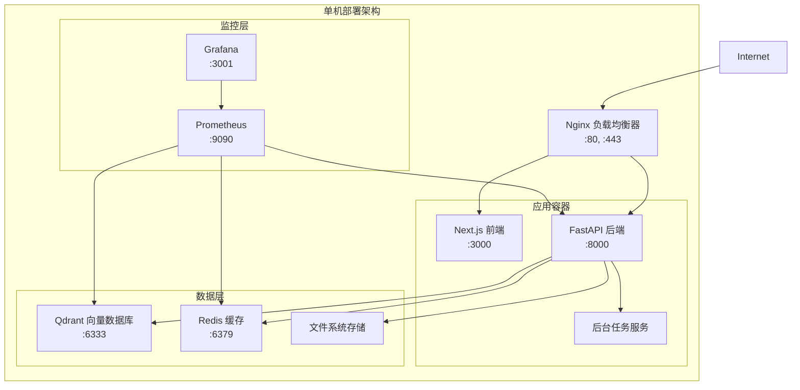
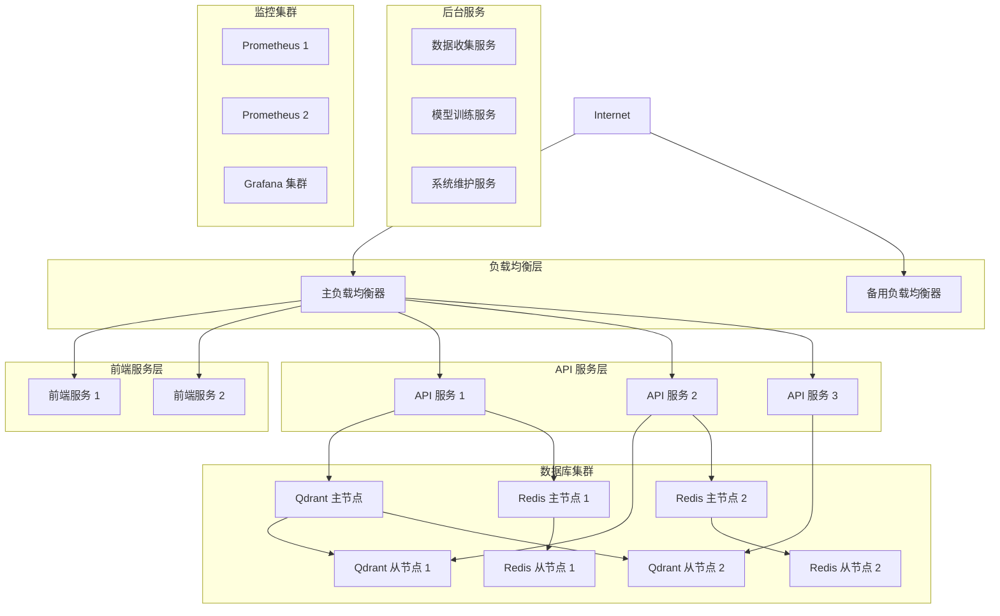

# RAG-AI 部署与运维指南

> **企业级部署、运维和生产环境管理完整指南**

本指南涵盖 RAG-AI 系统从开发环境到生产环境的完整部署流程、运维最佳实践和故障处理方案。

## 📋 目录

1. [环境准备](#1-环境准备)
2. [部署架构设计](#2-部署架构设计)
3. [开发环境部署](#3-开发环境部署)
4. [测试环境部署](#4-测试环境部署)
5. [生产环境部署](#5-生产环境部署)
6. [监控与告警](#6-监控与告警)
7. [备份与恢复](#7-备份与恢复)
8. [扩容与优化](#8-扩容与优化)
9. [安全配置](#9-安全配置)
10. [运维手册](#10-运维手册)

## 1. 环境准备

### 1.1 硬件要求

#### 1.1.1 最小配置要求

```yaml
# 开发环境最小配置
development:
  cpu: 4 cores
  memory: 8 GB
  storage: 50 GB SSD
  network: 100 Mbps

# 测试环境推荐配置
testing:
  cpu: 8 cores
  memory: 16 GB
  storage: 100 GB SSD
  network: 1 Gbps

# 生产环境推荐配置
production:
  api_server:
    cpu: 16 cores
    memory: 32 GB
    storage: 200 GB SSD (system) + 1 TB SSD (data)
    gpu: NVIDIA RTX 4090 或同等级别 (可选，用于本地模型推理)
  
  database_server:
    cpu: 8 cores
    memory: 16 GB
    storage: 500 GB SSD
  
  frontend_server:
    cpu: 4 cores  
    memory: 8 GB
    storage: 100 GB SSD
  
  load_balancer:
    cpu: 4 cores
    memory: 8 GB
    storage: 50 GB SSD
```

#### 1.1.2 高可用配置

```yaml
# 高可用生产环境
high_availability:
  api_servers: 3 instances (负载均衡)
  database_cluster:
    qdrant_nodes: 3 instances (集群模式)
    redis_cluster: 3 master + 3 slave
  frontend_servers: 2 instances (负载均衡)
  load_balancers: 2 instances (主备模式)
  
  # 网络要求
  internal_network: 10 Gbps
  external_network: 1 Gbps
  redundant_connections: yes
```

### 1.2 软件环境

#### 1.2.1 操作系统要求

```bash
# 支持的操作系统
Ubuntu 20.04+ LTS  # 推荐
CentOS 8+
Red Hat Enterprise Linux 8+
Docker 20.10+
Docker Compose 2.0+

# 系统更新
sudo apt update && sudo apt upgrade -y  # Ubuntu
sudo yum update -y                      # CentOS/RHEL

# 必要的系统包
sudo apt install -y curl wget git vim htop iotop nethogs  # Ubuntu
sudo yum install -y curl wget git vim htop iotop          # CentOS
```

#### 1.2.2 Docker 环境配置

```bash
#!/bin/bash
# install_docker.sh - Docker 安装脚本

set -e

echo "🐳 安装 Docker 和 Docker Compose..."

# 卸载旧版本
sudo apt remove docker docker-engine docker.io containerd runc 2>/dev/null || true

# 安装依赖
sudo apt update
sudo apt install -y \
    apt-transport-https \
    ca-certificates \
    curl \
    gnupg \
    lsb-release

# 添加 Docker 官方 GPG 密钥
curl -fsSL https://download.docker.com/linux/ubuntu/gpg | sudo gpg --dearmor -o /usr/share/keyrings/docker-archive-keyring.gpg

# 添加 Docker 仓库
echo \
  "deb [arch=$(dpkg --print-architecture) signed-by=/usr/share/keyrings/docker-archive-keyring.gpg] https://download.docker.com/linux/ubuntu \
  $(lsb_release -cs) stable" | sudo tee /etc/apt/sources.list.d/docker.list > /dev/null

# 安装 Docker Engine
sudo apt update
sudo apt install -y docker-ce docker-ce-cli containerd.io

# 启动 Docker 服务
sudo systemctl enable docker
sudo systemctl start docker

# 将当前用户添加到 docker 组
sudo usermod -aG docker $USER

# 安装 Docker Compose
DOCKER_COMPOSE_VERSION="2.24.0"
sudo curl -L "https://github.com/docker/compose/releases/download/v${DOCKER_COMPOSE_VERSION}/docker-compose-$(uname -s)-$(uname -m)" -o /usr/local/bin/docker-compose
sudo chmod +x /usr/local/bin/docker-compose

# 验证安装
docker --version
docker-compose --version

echo "✅ Docker 安装完成"
echo "🔄 请重新登录或运行 'newgrp docker' 以使用 docker 命令"
```

#### 1.2.3 系统参数优化

```bash
#!/bin/bash
# optimize_system.sh - 系统参数优化脚本

echo "⚙️  优化系统参数..."

# 内核参数优化
cat << EOF | sudo tee -a /etc/sysctl.conf
# RAG-AI 系统优化参数

# 网络优化
net.core.rmem_max = 134217728
net.core.wmem_max = 134217728
net.ipv4.tcp_rmem = 4096 87380 134217728
net.ipv4.tcp_wmem = 4096 65536 134217728
net.ipv4.tcp_congestion_control = bbr
net.core.netdev_max_backlog = 5000

# 文件描述符限制
fs.file-max = 2097152
fs.nr_open = 2097152

# 虚拟内存优化
vm.swappiness = 10
vm.dirty_ratio = 15
vm.dirty_background_ratio = 5

# 安全参数
kernel.randomize_va_space = 2
EOF

# 应用内核参数
sudo sysctl -p

# 用户限制优化
cat << EOF | sudo tee -a /etc/security/limits.conf
# RAG-AI 用户限制优化
* soft nofile 1048576
* hard nofile 1048576
* soft nproc 1048576  
* hard nproc 1048576
* soft memlock unlimited
* hard memlock unlimited
EOF

# Docker 守护程序优化
sudo mkdir -p /etc/docker
cat << EOF | sudo tee /etc/docker/daemon.json
{
  "log-driver": "json-file",
  "log-opts": {
    "max-size": "100m",
    "max-file": "3"
  },
  "storage-driver": "overlay2",
  "default-ulimits": {
    "nofile": {
      "Hard": 1048576,
      "Name": "nofile",
      "Soft": 1048576
    }
  }
}
EOF

sudo systemctl restart docker

echo "✅ 系统参数优化完成"
```

## 2. 部署架构设计

### 2.1 单机部署架构



### 2.2 分布式部署架构



### 2.3 云原生 Kubernetes 架构

```yaml
# k8s-architecture.yaml
apiVersion: v1
kind: Namespace
metadata:
  name: rag-ai

---
# ConfigMap for environment variables
apiVersion: v1
kind: ConfigMap
metadata:
  name: rag-ai-config
  namespace: rag-ai
data:
  QDRANT_HOST: "qdrant-service"
  QDRANT_PORT: "6333"
  REDIS_HOST: "redis-service"
  REDIS_PORT: "6379"
  STORAGE_ROOT: "/app/data"

---
# API Service Deployment
apiVersion: apps/v1
kind: Deployment
metadata:
  name: rag-ai-api
  namespace: rag-ai
spec:
  replicas: 3
  selector:
    matchLabels:
      app: rag-ai-api
  template:
    metadata:
      labels:
        app: rag-ai-api
    spec:
      containers:
      - name: api
        image: rag-ai/api:latest
        ports:
        - containerPort: 8000
        envFrom:
        - configMapRef:
            name: rag-ai-config
        resources:
          requests:
            memory: "2Gi"
            cpu: "1000m"
          limits:
            memory: "4Gi" 
            cpu: "2000m"
        livenessProbe:
          httpGet:
            path: /health
            port: 8000
          initialDelaySeconds: 30
          periodSeconds: 10
        readinessProbe:
          httpGet:
            path: /health/ready
            port: 8000
          initialDelaySeconds: 5
          periodSeconds: 5

---
# Frontend Service Deployment  
apiVersion: apps/v1
kind: Deployment
metadata:
  name: rag-ai-frontend
  namespace: rag-ai
spec:
  replicas: 2
  selector:
    matchLabels:
      app: rag-ai-frontend
  template:
    metadata:
      labels:
        app: rag-ai-frontend
    spec:
      containers:
      - name: frontend
        image: rag-ai/frontend:latest
        ports:
        - containerPort: 3000
        env:
        - name: NEXT_PUBLIC_API_URL
          value: "http://rag-ai-api-service:8000"
        resources:
          requests:
            memory: "512Mi"
            cpu: "250m"
          limits:
            memory: "1Gi"
            cpu: "500m"

---
# Qdrant StatefulSet
apiVersion: apps/v1
kind: StatefulSet
metadata:
  name: qdrant
  namespace: rag-ai
spec:
  serviceName: qdrant-service
  replicas: 3
  selector:
    matchLabels:
      app: qdrant
  template:
    metadata:
      labels:
        app: qdrant
    spec:
      containers:
      - name: qdrant
        image: qdrant/qdrant:v1.7.0
        ports:
        - containerPort: 6333
        - containerPort: 6334
        volumeMounts:
        - name: qdrant-storage
          mountPath: /qdrant/storage
        resources:
          requests:
            memory: "4Gi"
            cpu: "2000m"
          limits:
            memory: "8Gi"
            cpu: "4000m"
  volumeClaimTemplates:
  - metadata:
      name: qdrant-storage
    spec:
      accessModes: ["ReadWriteOnce"]
      resources:
        requests:
          storage: 100Gi

---
# Services
apiVersion: v1
kind: Service
metadata:
  name: rag-ai-api-service
  namespace: rag-ai
spec:
  selector:
    app: rag-ai-api
  ports:
  - port: 8000
    targetPort: 8000
  type: ClusterIP

---
apiVersion: v1
kind: Service
metadata:
  name: rag-ai-frontend-service
  namespace: rag-ai
spec:
  selector:
    app: rag-ai-frontend
  ports:
  - port: 3000
    targetPort: 3000
  type: ClusterIP

---
apiVersion: v1
kind: Service
metadata:
  name: qdrant-service
  namespace: rag-ai
spec:
  selector:
    app: qdrant
  ports:
  - name: http
    port: 6333
    targetPort: 6333
  - name: grpc
    port: 6334
    targetPort: 6334
  clusterIP: None

---
# Ingress
apiVersion: networking.k8s.io/v1
kind: Ingress
metadata:
  name: rag-ai-ingress
  namespace: rag-ai
  annotations:
    nginx.ingress.kubernetes.io/rewrite-target: /
    nginx.ingress.kubernetes.io/ssl-redirect: "true"
    cert-manager.io/cluster-issuer: "letsencrypt-prod"
spec:
  tls:
  - hosts:
    - rag-ai.yourdomain.com
    secretName: rag-ai-tls
  rules:
  - host: rag-ai.yourdomain.com
    http:
      paths:
      - path: /api
        pathType: Prefix
        backend:
          service:
            name: rag-ai-api-service
            port:
              number: 8000
      - path: /
        pathType: Prefix
        backend:
          service:
            name: rag-ai-frontend-service
            port:
              number: 3000
```

## 3. 开发环境部署

### 3.1 快速启动指南

```bash
#!/bin/bash
# dev_setup.sh - 开发环境快速设置脚本

set -e

echo "🚀 RAG-AI 开发环境设置开始..."

# 检查依赖
command -v docker >/dev/null 2>&1 || { echo "❌ Docker 未安装"; exit 1; }
command -v docker-compose >/dev/null 2>&1 || { echo "❌ Docker Compose 未安装"; exit 1; }

# 克隆项目（如果不存在）
if [ ! -d "rag-ai" ]; then
    git clone https://github.com/your-username/rag-ai.git
    cd rag-ai
else
    cd rag-ai
    git pull origin main
fi

# 复制环境配置文件
if [ ! -f ".env" ]; then
    cp .env.example .env
    echo "⚙️  已创建 .env 文件，请根据需要调整配置"
fi

# 创建必要目录
mkdir -p data logs models

# 设置权限
sudo chown -R $USER:$USER data logs models

# 启动开发环境
echo "🐳 启动 Docker 容器..."
docker-compose -f docker-compose.dev.yml up -d

# 等待服务启动
echo "⏳ 等待服务启动..."
sleep 30

# 健康检查
echo "🔍 检查服务状态..."
services=("qdrant:6333" "redis:6379" "api:8000" "frontend:3000")
for service in "${services[@]}"; do
    IFS=':' read -r name port <<< "$service"
    if curl -s -o /dev/null -w "%{http_code}" "http://localhost:$port" | grep -q "200\|000"; then
        echo "✅ $name 服务运行正常"
    else
        echo "❌ $name 服务启动失败"
    fi
done

echo ""
echo "🎉 开发环境设置完成！"
echo ""
echo "📍 访问地址："
echo "   前端应用: http://localhost:3000"
echo "   API 文档: http://localhost:8000/docs"
echo "   Grafana: http://localhost:3001 (admin/admin123)"
echo ""
echo "📝 常用命令："
echo "   查看日志: docker-compose -f docker-compose.dev.yml logs -f"
echo "   停止服务: docker-compose -f docker-compose.dev.yml down"
echo "   重启服务: docker-compose -f docker-compose.dev.yml restart"
echo ""
```

### 3.2 开发环境配置

```yaml
# docker-compose.dev.yml
version: '3.8'

services:
  # 开发数据库
  qdrant-dev:
    image: qdrant/qdrant:v1.7.0
    container_name: rag-ai-qdrant-dev
    ports:
      - "6333:6333"
      - "6334:6334"
    volumes:
      - qdrant_data_dev:/qdrant/storage
    environment:
      - QDRANT__LOG_LEVEL=DEBUG
    networks:
      - dev-network

  redis-dev:
    image: redis:7.2-alpine
    container_name: rag-ai-redis-dev
    ports:
      - "6379:6379"
    volumes:
      - redis_data_dev:/data
    command: redis-server --appendonly yes --maxmemory 256mb
    networks:
      - dev-network

  # API 开发服务
  api-dev:
    build:
      context: .
      dockerfile: Dockerfile.api
      target: development
    container_name: rag-ai-api-dev
    ports:
      - "8000:8000"
    volumes:
      - .:/app
      - model_cache_dev:/app/models
    environment:
      - PYTHONPATH=/app
      - FASTAPI_ENV=development
      - RELOAD=true
      - LOG_LEVEL=DEBUG
    depends_on:
      - qdrant-dev
      - redis-dev
    networks:
      - dev-network

  # 前端开发服务
  frontend-dev:
    build:
      context: ./frontend
      dockerfile: Dockerfile.dev
    container_name: rag-ai-frontend-dev
    ports:
      - "3000:3000"
    volumes:
      - ./frontend:/app
      - /app/node_modules
      - /app/.next
    environment:
      - NODE_ENV=development
      - NEXT_PUBLIC_API_URL=http://localhost:8000
      - WATCHPACK_POLLING=true
    networks:
      - dev-network

  # 开发工具
  maildev:
    image: maildev/maildev
    container_name: rag-ai-maildev
    ports:
      - "1080:1080"  # Web UI
      - "1025:1025"  # SMTP
    networks:
      - dev-network

volumes:
  qdrant_data_dev:
  redis_data_dev:
  model_cache_dev:

networks:
  dev-network:
    driver: bridge
```

### 3.3 开发工具配置

#### 3.3.1 VSCode 配置

```json
// .vscode/settings.json
{
    "python.defaultInterpreterPath": "./.venv/bin/python",
    "python.linting.enabled": true,
    "python.linting.pylintEnabled": true,
    "python.linting.flake8Enabled": true,
    "python.formatting.provider": "black",
    "python.sortImports.args": [
        "--profile",
        "black"
    ],
    "editor.formatOnSave": true,
    "editor.codeActionsOnSave": {
        "source.organizeImports": true
    },
    "files.exclude": {
        "**/__pycache__": true,
        "**/.pytest_cache": true,
        "**/node_modules": true,
        "**/.next": true
    },
    "docker.dockerComposeBuild": true,
    "docker.dockerComposeDetached": true
}
```

```json
// .vscode/launch.json
{
    "version": "0.2.0",
    "configurations": [
        {
            "name": "Python: FastAPI",
            "type": "python",
            "request": "launch",
            "program": "${workspaceFolder}/.venv/bin/uvicorn",
            "args": [
                "api.main:app",
                "--reload",
                "--host",
                "0.0.0.0",
                "--port",
                "8000"
            ],
            "env": {
                "PYTHONPATH": "${workspaceFolder}"
            },
            "console": "integratedTerminal",
            "justMyCode": false
        },
        {
            "name": "Debug Tests",
            "type": "python",
            "request": "launch",
            "module": "pytest",
            "args": [
                "${workspaceFolder}/tests",
                "-v",
                "-s"
            ],
            "env": {
                "PYTHONPATH": "${workspaceFolder}"
            },
            "console": "integratedTerminal",
            "justMyCode": false
        }
    ]
}
```

#### 3.3.2 代码质量工具

```toml
# pyproject.toml
[tool.black]
line-length = 88
target-version = ['py310']
include = '\.pyi?$'
extend-exclude = '''
/(
  # directories
  \.eggs
  | \.git
  | \.hg
  | \.mypy_cache
  | \.tox
  | \.venv
  | build
  | dist
)/
'''

[tool.isort]
profile = "black"
multi_line_output = 3
line_length = 88
known_first_party = ["src", "api", "tests"]

[tool.pylint.messages_control]
disable = "C0330, C0326"

[tool.pytest.ini_options]
testpaths = ["tests"]
python_files = ["test_*.py"]
python_functions = ["test_*"]
addopts = "-v --tb=short --strict-markers"
markers = [
    "slow: marks tests as slow (deselect with '-m \"not slow\"')",
    "integration: marks tests as integration tests",
    "unit: marks tests as unit tests"
]
```

```yaml
# .github/workflows/ci.yml
name: CI/CD Pipeline

on:
  push:
    branches: [ main, develop ]
  pull_request:
    branches: [ main ]

jobs:
  test:
    runs-on: ubuntu-latest
    
    services:
      qdrant:
        image: qdrant/qdrant:v1.7.0
        ports:
          - 6333:6333
      redis:
        image: redis:7.2-alpine
        ports:
          - 6379:6379

    steps:
    - uses: actions/checkout@v3
    
    - name: Set up Python
      uses: actions/setup-python@v4
      with:
        python-version: '3.11'
    
    - name: Install dependencies
      run: |
        python -m pip install --upgrade pip
        pip install -r requirements.txt
        pip install -r requirements-dev.txt
    
    - name: Lint with flake8
      run: |
        flake8 src api tests
    
    - name: Format check with black
      run: |
        black --check src api tests
    
    - name: Type check with mypy
      run: |
        mypy src api
    
    - name: Test with pytest
      run: |
        pytest tests/ -v --cov=src --cov-report=xml
    
    - name: Upload coverage
      uses: codecov/codecov-action@v3
      with:
        file: ./coverage.xml

  build:
    needs: test
    runs-on: ubuntu-latest
    
    steps:
    - uses: actions/checkout@v3
    
    - name: Build Docker images
      run: |
        docker build -t rag-ai/api:latest -f Dockerfile.api .
        docker build -t rag-ai/frontend:latest -f frontend/Dockerfile ./frontend
    
    - name: Test Docker containers
      run: |
        docker-compose -f docker-compose.test.yml up -d
        sleep 30
        docker-compose -f docker-compose.test.yml exec -T api curl -f http://localhost:8000/health
        docker-compose -f docker-compose.test.yml down
```

## 4. 测试环境部署

### 4.1 测试环境配置

```yaml
# docker-compose.test.yml
version: '3.8'

services:
  # 测试数据库
  qdrant-test:
    image: qdrant/qdrant:v1.7.0
    container_name: rag-ai-qdrant-test
    ports:
      - "6333:6333"
    volumes:
      - qdrant_test_data:/qdrant/storage
    environment:
      - QDRANT__LOG_LEVEL=INFO
    networks:
      - test-network

  redis-test:
    image: redis:7.2-alpine
    container_name: rag-ai-redis-test
    ports:
      - "6379:6379"
    volumes:
      - redis_test_data:/data
    command: redis-server --appendonly yes
    networks:
      - test-network

  # API 测试服务
  api-test:
    build:
      context: .
      dockerfile: Dockerfile.api
      target: testing
    container_name: rag-ai-api-test
    ports:
      - "8000:8000"
    environment:
      - PYTHONPATH=/app
      - FASTAPI_ENV=testing
      - QDRANT_HOST=qdrant-test
      - REDIS_HOST=redis-test
      - LOG_LEVEL=INFO
    depends_on:
      - qdrant-test
      - redis-test
    networks:
      - test-network

  # 前端测试服务
  frontend-test:
    build:
      context: ./frontend
      dockerfile: Dockerfile
    container_name: rag-ai-frontend-test
    ports:
      - "3000:3000"
    environment:
      - NODE_ENV=production
      - NEXT_PUBLIC_API_URL=http://api-test:8000
    networks:
      - test-network

  # 端到端测试
  e2e-tests:
    build:
      context: ./tests/e2e
      dockerfile: Dockerfile
    container_name: rag-ai-e2e-tests
    depends_on:
      - api-test
      - frontend-test
    environment:
      - API_BASE_URL=http://api-test:8000
      - FRONTEND_BASE_URL=http://frontend-test:3000
    volumes:
      - ./tests/e2e/results:/app/results
    networks:
      - test-network

volumes:
  qdrant_test_data:
  redis_test_data:

networks:
  test-network:
    driver: bridge
```

### 4.2 自动化测试流程

```bash
#!/bin/bash
# run_tests.sh - 自动化测试脚本

set -e

echo "🧪 启动自动化测试流程..."

# 清理之前的测试环境
echo "🧹 清理测试环境..."
docker-compose -f docker-compose.test.yml down -v
docker system prune -f

# 构建测试镜像
echo "🔨 构建测试镜像..."
docker-compose -f docker-compose.test.yml build

# 启动测试环境
echo "🚀 启动测试环境..."
docker-compose -f docker-compose.test.yml up -d qdrant-test redis-test api-test frontend-test

# 等待服务就绪
echo "⏳ 等待服务就绪..."
timeout 120 bash -c 'until curl -f http://localhost:8000/health; do sleep 2; done'
timeout 120 bash -c 'until curl -f http://localhost:3000; do sleep 2; done'

# 运行单元测试
echo "🔬 运行单元测试..."
docker-compose -f docker-compose.test.yml exec -T api-test pytest tests/unit/ -v

# 运行集成测试
echo "🔗 运行集成测试..."
docker-compose -f docker-compose.test.yml exec -T api-test pytest tests/integration/ -v

# 运行 API 测试
echo "🌐 运行 API 测试..."
docker-compose -f docker-compose.test.yml exec -T api-test pytest tests/api/ -v

# 运行端到端测试
echo "🎭 运行端到端测试..."
docker-compose -f docker-compose.test.yml run --rm e2e-tests

# 运行性能测试
echo "⚡ 运行性能测试..."
docker-compose -f docker-compose.test.yml exec -T api-test pytest tests/performance/ -v

# 运行安全测试
echo "🔒 运行安全测试..."
docker run --rm -v $(pwd):/app -w /app bandit -r src/ api/

# 生成测试报告
echo "📊 生成测试报告..."
docker-compose -f docker-compose.test.yml exec -T api-test python -m pytest tests/ --html=tests/reports/report.html --self-contained-html

# 代码覆盖率报告
echo "📈 生成覆盖率报告..."
docker-compose -f docker-compose.test.yml exec -T api-test coverage report
docker-compose -f docker-compose.test.yml exec -T api-test coverage html -d tests/coverage/

echo "✅ 所有测试完成"
echo "📋 测试报告位置："
echo "   HTML 报告: tests/reports/report.html"
echo "   覆盖率报告: tests/coverage/index.html"

# 清理测试环境
echo "🧹 清理测试环境..."
docker-compose -f docker-compose.test.yml down -v

echo "🎉 测试流程完成！"
```

### 4.3 测试数据管理

```python
# tests/conftest.py - 测试配置和fixtures

import pytest
import asyncio
import tempfile
import shutil
from pathlib import Path
from typing import AsyncGenerator, Generator
import numpy as np

from src.retrieval.vector_database import VectorDatabaseManager
from src.data_ingestion.multi_source_collector import MultiSourceCollector

@pytest.fixture(scope="session")
def event_loop():
    """创建会话级别的事件循环"""
    loop = asyncio.get_event_loop_policy().new_event_loop()
    yield loop
    loop.close()

@pytest.fixture(scope="session")
def temp_data_dir() -> Generator[Path, None, None]:
    """创建临时数据目录"""
    temp_dir = tempfile.mkdtemp()
    data_dir = Path(temp_dir)
    
    # 创建必要的子目录
    (data_dir / "raw").mkdir(parents=True)
    (data_dir / "processed").mkdir(parents=True)
    (data_dir / "models").mkdir(parents=True)
    (data_dir / "logs").mkdir(parents=True)
    
    yield data_dir
    
    # 清理
    shutil.rmtree(temp_dir)

@pytest.fixture(scope="session")
def test_config(temp_data_dir: Path) -> dict:
    """测试配置"""
    return {
        "STORAGE_ROOT": str(temp_data_dir),
        "QDRANT_HOST": "localhost",
        "QDRANT_PORT": 6333,
        "REDIS_HOST": "localhost", 
        "REDIS_PORT": 6379,
        "COLLECTION_NAME": "test_collection",
        "EMBEDDING_MODEL": "sentence-transformers/all-MiniLM-L6-v2",
        "LLM_MODEL": "microsoft/DialoGPT-medium",
        "ENABLE_CACHE": False,  # 测试时禁用缓存
        "LOG_LEVEL": "DEBUG"
    }

@pytest.fixture
async def vector_db_manager(test_config: dict) -> AsyncGenerator[VectorDatabaseManager, None]:
    """创建向量数据库管理器"""
    manager = VectorDatabaseManager(test_config)
    
    # 初始化测试集合
    await manager.initialize_collection()
    
    yield manager
    
    # 清理
    try:
        await manager.delete_collection()
    except:
        pass

@pytest.fixture
def sample_documents() -> list:
    """样本文档数据"""
    return [
        {
            "id": "doc1",
            "title": "Introduction to Machine Learning",
            "content": "Machine learning is a subset of artificial intelligence that focuses on algorithms.",
            "authors": ["John Doe", "Jane Smith"],
            "published_date": "2023-01-15",
            "source": "arxiv",
            "categories": ["cs.LG", "cs.AI"]
        },
        {
            "id": "doc2", 
            "title": "Deep Learning Fundamentals",
            "content": "Deep learning uses neural networks with multiple layers to model complex patterns.",
            "authors": ["Alice Johnson"],
            "published_date": "2023-02-20",
            "source": "journal",
            "categories": ["cs.LG", "cs.NE"]
        },
        {
            "id": "doc3",
            "title": "Natural Language Processing with Transformers",
            "content": "Transformers have revolutionized natural language processing tasks.",
            "authors": ["Bob Wilson", "Carol Brown"],
            "published_date": "2023-03-10", 
            "source": "huggingface",
            "categories": ["cs.CL", "cs.AI"]
        }
    ]

@pytest.fixture
def sample_vectors() -> list:
    """样本向量数据"""
    np.random.seed(42)  # 确保可重复性
    return [
        np.random.random(384).tolist() for _ in range(3)
    ]

@pytest.fixture
async def populated_vector_db(vector_db_manager: VectorDatabaseManager, 
                             sample_documents: list, 
                             sample_vectors: list) -> VectorDatabaseManager:
    """填充了测试数据的向量数据库"""
    # 准备测试数据
    test_chunks = []
    for i, (doc, vector) in enumerate(zip(sample_documents, sample_vectors)):
        chunk = {
            "chunk_id": f"chunk_{i}",
            "content": doc["content"],
            "embedding": vector,
            "metadata": {
                "document_id": doc["id"],
                "title": doc["title"],
                "authors": doc["authors"],
                "published_date": doc["published_date"],
                "source": doc["source"],
                "categories": doc["categories"]
            }
        }
        test_chunks.append(chunk)
    
    # 插入测试数据
    await vector_db_manager.add_chunks(test_chunks)
    
    return vector_db_manager

class MockAPIClient:
    """模拟外部 API 客户端"""
    
    def __init__(self):
        self.call_count = 0
        self.responses = {}
    
    def set_response(self, endpoint: str, response: dict):
        """设置模拟响应"""
        self.responses[endpoint] = response
    
    async def get(self, endpoint: str) -> dict:
        """模拟 GET 请求"""
        self.call_count += 1
        return self.responses.get(endpoint, {"error": "Not found"})
    
    async def post(self, endpoint: str, data: dict) -> dict:
        """模拟 POST 请求"""
        self.call_count += 1
        return self.responses.get(endpoint, {"result": "success"})

@pytest.fixture
def mock_api_client() -> MockAPIClient:
    """模拟 API 客户端"""
    return MockAPIClient()

# 性能测试辅助函数
@pytest.fixture
def performance_test_data():
    """性能测试数据生成器"""
    def generate_test_data(count: int = 1000):
        """生成指定数量的测试数据"""
        np.random.seed(42)
        
        documents = []
        for i in range(count):
            doc = {
                "id": f"perf_doc_{i}",
                "title": f"Performance Test Document {i}",
                "content": f"This is test content for document {i}. " * 10,
                "authors": [f"Author {i % 5}"],
                "published_date": f"2023-{(i % 12) + 1:02d}-{(i % 28) + 1:02d}",
                "source": ["arxiv", "journal", "huggingface"][i % 3],
                "categories": [f"cs.{i % 10}"],
                "embedding": np.random.random(384).tolist()
            }
            documents.append(doc)
        
        return documents
    
    return generate_test_data

# 测试装饰器
def slow_test(func):
    """标记慢速测试"""
    return pytest.mark.slow(func)

def integration_test(func):
    """标记集成测试"""
    return pytest.mark.integration(func)

def unit_test(func):
    """标记单元测试"""
    return pytest.mark.unit(func)
```

## 5. 生产环境部署

### 5.1 生产环境配置

```bash
#!/bin/bash
# production_deploy.sh - 生产环境部署脚本

set -e

echo "🚀 开始生产环境部署..."

# 检查环境变量
required_vars=("DOMAIN_NAME" "DOCKER_REGISTRY" "DB_PASSWORD" "SSL_EMAIL")
for var in "${required_vars[@]}"; do
    if [ -z "${!var}" ]; then
        echo "❌ 环境变量 $var 未设置"
        exit 1
    fi
done

# 服务器信息
PROD_SERVERS=(
    "app-server-1:user@10.0.1.10"
    "app-server-2:user@10.0.1.11"
    "db-server:user@10.0.1.20"
    "lb-server:user@10.0.1.5"
)

# 部署到各服务器
for server_info in "${PROD_SERVERS[@]}"; do
    IFS=':' read -r server_name connection <<< "$server_info"
    
    echo "📡 部署到 $server_name ($connection)..."
    
    # 上传配置文件
    scp docker-compose.prod.yml $connection:/opt/rag-ai/
    scp production.env $connection:/opt/rag-ai/.env
    
    # 远程执行部署
    ssh $connection << 'EOF'
        cd /opt/rag-ai
        
        # 拉取最新镜像
        docker-compose -f docker-compose.prod.yml pull
        
        # 停止旧服务
        docker-compose -f docker-compose.prod.yml down
        
        # 启动新服务
        docker-compose -f docker-compose.prod.yml up -d
        
        # 健康检查
        sleep 30
        docker-compose -f docker-compose.prod.yml ps
EOF
    
    echo "✅ $server_name 部署完成"
done

# 配置负载均衡器
echo "⚖️  配置负载均衡器..."
ssh user@10.0.1.5 << 'EOF'
    # 更新 Nginx 配置
    sudo cp /opt/rag-ai/nginx/nginx.prod.conf /etc/nginx/nginx.conf
    sudo nginx -t
    sudo systemctl reload nginx
    
    # 申请 SSL 证书（如果需要）
    sudo certbot --nginx -d $DOMAIN_NAME --non-interactive --agree-tos --email $SSL_EMAIL
EOF

# 验证部署
echo "🔍 验证部署状态..."
for ((i=1; i<=5; i++)); do
    if curl -f https://$DOMAIN_NAME/health; then
        echo "✅ 生产环境部署成功！"
        echo "🌐 访问地址: https://$DOMAIN_NAME"
        break
    else
        echo "⏳ 等待服务启动... ($i/5)"
        sleep 30
    fi
done

echo "🎉 生产环境部署完成！"
```

### 5.2 生产环境配置文件

```yaml
# docker-compose.prod.yml
version: '3.8'

services:
  # Qdrant 集群
  qdrant-1:
    image: qdrant/qdrant:v1.7.0
    container_name: rag-ai-qdrant-1
    restart: unless-stopped
    ports:
      - "6333:6333"
      - "6334:6334"
    volumes:
      - qdrant_data_1:/qdrant/storage
    environment:
      - QDRANT__CLUSTER__ENABLED=true
      - QDRANT__CLUSTER__P2P__PORT=6335
      - QDRANT__CLUSTER__CONSENSUS__ENABLED=true
    networks:
      - prod-network
    deploy:
      resources:
        limits:
          memory: 8G
          cpus: '4'
        reservations:
          memory: 4G
          cpus: '2'

  qdrant-2:
    image: qdrant/qdrant:v1.7.0
    container_name: rag-ai-qdrant-2
    restart: unless-stopped
    ports:
      - "6336:6333"
      - "6337:6334"
    volumes:
      - qdrant_data_2:/qdrant/storage
    environment:
      - QDRANT__CLUSTER__ENABLED=true
      - QDRANT__CLUSTER__P2P__PORT=6335
      - QDRANT__CLUSTER__CONSENSUS__ENABLED=true
      - QDRANT__CLUSTER__BOOTSTRAP__ENABLED=true
      - QDRANT__CLUSTER__BOOTSTRAP__NODES=qdrant-1:6335
    depends_on:
      - qdrant-1
    networks:
      - prod-network
    deploy:
      resources:
        limits:
          memory: 8G
          cpus: '4'
        reservations:
          memory: 4G
          cpus: '2'

  # Redis 主从复制
  redis-master:
    image: redis:7.2-alpine
    container_name: rag-ai-redis-master
    restart: unless-stopped
    ports:
      - "6379:6379"
    volumes:
      - redis_master_data:/data
      - ./redis/redis.conf:/usr/local/etc/redis/redis.conf
    command: redis-server /usr/local/etc/redis/redis.conf
    networks:
      - prod-network
    deploy:
      resources:
        limits:
          memory: 4G
          cpus: '2'
        reservations:
          memory: 2G
          cpus: '1'

  redis-slave:
    image: redis:7.2-alpine
    container_name: rag-ai-redis-slave
    restart: unless-stopped
    ports:
      - "6380:6379"
    volumes:
      - redis_slave_data:/data
    command: redis-server --slaveof redis-master 6379
    depends_on:
      - redis-master
    networks:
      - prod-network
    deploy:
      resources:
        limits:
          memory: 4G
          cpus: '2'
        reservations:
          memory: 2G
          cpus: '1'

  # API 服务集群
  api-1:
    image: ${DOCKER_REGISTRY}/rag-ai/api:${VERSION}
    container_name: rag-ai-api-1
    restart: unless-stopped
    ports:
      - "8001:8000"
    env_file:
      - .env
    environment:
      - INSTANCE_ID=api-1
      - QDRANT_HOSTS=qdrant-1:6333,qdrant-2:6333
      - REDIS_HOST=redis-master
    volumes:
      - api_data:/app/data
      - api_logs:/app/logs
      - model_cache:/app/models
    depends_on:
      - qdrant-1
      - qdrant-2
      - redis-master
    networks:
      - prod-network
    deploy:
      resources:
        limits:
          memory: 16G
          cpus: '8'
        reservations:
          memory: 8G
          cpus: '4'
    healthcheck:
      test: ["CMD", "curl", "-f", "http://localhost:8000/health"]
      interval: 30s
      timeout: 10s
      retries: 3

  api-2:
    image: ${DOCKER_REGISTRY}/rag-ai/api:${VERSION}
    container_name: rag-ai-api-2
    restart: unless-stopped
    ports:
      - "8002:8000"
    env_file:
      - .env
    environment:
      - INSTANCE_ID=api-2
      - QDRANT_HOSTS=qdrant-1:6333,qdrant-2:6333
      - REDIS_HOST=redis-master
    volumes:
      - api_data:/app/data
      - api_logs:/app/logs
      - model_cache:/app/models
    depends_on:
      - qdrant-1
      - qdrant-2
      - redis-master
    networks:
      - prod-network
    deploy:
      resources:
        limits:
          memory: 16G
          cpus: '8'
        reservations:
          memory: 8G
          cpus: '4'
    healthcheck:
      test: ["CMD", "curl", "-f", "http://localhost:8000/health"]
      interval: 30s
      timeout: 10s
      retries: 3

  # 前端服务
  frontend-1:
    image: ${DOCKER_REGISTRY}/rag-ai/frontend:${VERSION}
    container_name: rag-ai-frontend-1
    restart: unless-stopped
    ports:
      - "3001:3000"
    environment:
      - NODE_ENV=production
      - NEXT_PUBLIC_API_URL=https://${DOMAIN_NAME}/api
    networks:
      - prod-network
    deploy:
      resources:
        limits:
          memory: 2G
          cpus: '2'
        reservations:
          memory: 1G
          cpus: '1'

  frontend-2:
    image: ${DOCKER_REGISTRY}/rag-ai/frontend:${VERSION}
    container_name: rag-ai-frontend-2
    restart: unless-stopped
    ports:
      - "3002:3000"
    environment:
      - NODE_ENV=production
      - NEXT_PUBLIC_API_URL=https://${DOMAIN_NAME}/api
    networks:
      - prod-network
    deploy:
      resources:
        limits:
          memory: 2G
          cpus: '2'
        reservations:
          memory: 1G
          cpus: '1'

  # 后台任务服务
  background-worker:
    image: ${DOCKER_REGISTRY}/rag-ai/api:${VERSION}
    container_name: rag-ai-background-worker
    restart: unless-stopped
    env_file:
      - .env
    environment:
      - WORKER_TYPE=background
      - QDRANT_HOSTS=qdrant-1:6333,qdrant-2:6333
      - REDIS_HOST=redis-master
    volumes:
      - api_data:/app/data
      - api_logs:/app/logs
      - model_cache:/app/models
    command: python -m src.background.worker
    depends_on:
      - redis-master
    networks:
      - prod-network
    deploy:
      resources:
        limits:
          memory: 8G
          cpus: '4'
        reservations:
          memory: 4G
          cpus: '2'

  # 监控服务
  prometheus:
    image: prom/prometheus:v2.47.0
    container_name: rag-ai-prometheus
    restart: unless-stopped
    ports:
      - "9090:9090"
    volumes:
      - ./monitoring/prometheus.prod.yml:/etc/prometheus/prometheus.yml
      - prometheus_data:/prometheus
    command:
      - '--config.file=/etc/prometheus/prometheus.yml'
      - '--storage.tsdb.path=/prometheus'
      - '--storage.tsdb.retention.time=90d'
      - '--web.enable-lifecycle'
      - '--web.enable-admin-api'
    networks:
      - prod-network

  grafana:
    image: grafana/grafana:10.1.0
    container_name: rag-ai-grafana
    restart: unless-stopped
    ports:
      - "3000:3000"
    volumes:
      - grafana_data:/var/lib/grafana
      - ./monitoring/grafana/provisioning:/etc/grafana/provisioning
    environment:
      - GF_SECURITY_ADMIN_PASSWORD=${GRAFANA_PASSWORD}
      - GF_USERS_ALLOW_SIGN_UP=false
      - GF_SERVER_DOMAIN=${DOMAIN_NAME}
      - GF_SERVER_ROOT_URL=https://${DOMAIN_NAME}/grafana/
    networks:
      - prod-network

  # 日志聚合
  fluentd:
    image: fluent/fluentd:v1.16-debian-1
    container_name: rag-ai-fluentd
    restart: unless-stopped
    ports:
      - "24224:24224"
    volumes:
      - ./logging/fluentd.conf:/fluentd/etc/fluent.conf
      - log_data:/var/log/fluentd
    networks:
      - prod-network

volumes:
  qdrant_data_1:
    driver: local
  qdrant_data_2:
    driver: local
  redis_master_data:
    driver: local
  redis_slave_data:
    driver: local
  api_data:
    driver: local
  api_logs:
    driver: local
  model_cache:
    driver: local
  prometheus_data:
    driver: local
  grafana_data:
    driver: local
  log_data:
    driver: local

networks:
  prod-network:
    driver: bridge
    ipam:
      config:
        - subnet: 172.30.0.0/16
```

### 5.3 SSL 和安全配置

```nginx
# nginx/nginx.prod.conf
user nginx;
worker_processes auto;
error_log /var/log/nginx/error.log warn;
pid /var/run/nginx.pid;

events {
    worker_connections 4096;
    use epoll;
    multi_accept on;
}

http {
    include /etc/nginx/mime.types;
    default_type application/octet-stream;

    # 日志格式
    log_format main '$remote_addr - $remote_user [$time_local] "$request" '
                    '$status $body_bytes_sent "$http_referer" '
                    '"$http_user_agent" "$http_x_forwarded_for" '
                    'rt=$request_time uct="$upstream_connect_time" '
                    'uht="$upstream_header_time" urt="$upstream_response_time"';

    access_log /var/log/nginx/access.log main;

    # 基础设置
    sendfile on;
    tcp_nopush on;
    tcp_nodelay on;
    keepalive_timeout 65;
    keepalive_requests 1000;
    client_max_body_size 100M;
    client_body_timeout 60s;
    client_header_timeout 60s;

    # Gzip 压缩
    gzip on;
    gzip_vary on;
    gzip_min_length 1024;
    gzip_proxied any;
    gzip_comp_level 6;
    gzip_types
        text/plain
        text/css
        text/xml
        text/javascript
        application/json
        application/javascript
        application/xml+rss
        application/atom+xml
        image/svg+xml;

    # 安全头
    add_header X-Frame-Options DENY always;
    add_header X-Content-Type-Options nosniff always;
    add_header X-XSS-Protection "1; mode=block" always;
    add_header Referrer-Policy "strict-origin-when-cross-origin" always;
    add_header Content-Security-Policy "default-src 'self'; script-src 'self' 'unsafe-inline' 'unsafe-eval'; style-src 'self' 'unsafe-inline'; img-src 'self' data: https:; font-src 'self'; connect-src 'self' https:; frame-ancestors 'none';" always;

    # 速率限制
    limit_req_zone $binary_remote_addr zone=api:10m rate=100r/s;
    limit_req_zone $binary_remote_addr zone=search:10m rate=20r/s;
    limit_req_zone $binary_remote_addr zone=login:10m rate=5r/m;

    # 上游服务器
    upstream api_backend {
        least_conn;
        server rag-ai-api-1:8000 max_fails=3 fail_timeout=30s;
        server rag-ai-api-2:8000 max_fails=3 fail_timeout=30s;
        keepalive 32;
        keepalive_requests 1000;
        keepalive_timeout 60s;
    }

    upstream frontend_backend {
        least_conn;
        server rag-ai-frontend-1:3000 max_fails=3 fail_timeout=30s;
        server rag-ai-frontend-2:3000 max_fails=3 fail_timeout=30s;
        keepalive 32;
        keepalive_requests 1000;
        keepalive_timeout 60s;
    }

    # HTTP 重定向到 HTTPS
    server {
        listen 80;
        server_name rag-ai.yourdomain.com;
        return 301 https://$server_name$request_uri;
    }

    # HTTPS 主服务器
    server {
        listen 443 ssl http2;
        server_name rag-ai.yourdomain.com;

        # SSL 配置
        ssl_certificate /etc/letsencrypt/live/rag-ai.yourdomain.com/fullchain.pem;
        ssl_certificate_key /etc/letsencrypt/live/rag-ai.yourdomain.com/privkey.pem;
        ssl_session_cache shared:SSL:10m;
        ssl_session_timeout 10m;
        ssl_protocols TLSv1.2 TLSv1.3;
        ssl_ciphers ECDHE-RSA-AES256-GCM-SHA512:DHE-RSA-AES256-GCM-SHA512:ECDHE-RSA-AES256-GCM-SHA384:DHE-RSA-AES256-GCM-SHA384;
        ssl_prefer_server_ciphers off;
        ssl_stapling on;
        ssl_stapling_verify on;

        # API 路由
        location /api/ {
            limit_req zone=api burst=200 nodelay;
            
            proxy_pass http://api_backend/;
            proxy_http_version 1.1;
            proxy_set_header Upgrade $http_upgrade;
            proxy_set_header Connection 'upgrade';
            proxy_set_header Host $host;
            proxy_set_header X-Real-IP $remote_addr;
            proxy_set_header X-Forwarded-For $proxy_add_x_forwarded_for;
            proxy_set_header X-Forwarded-Proto $scheme;
            proxy_cache_bypass $http_upgrade;
            
            # 超时设置
            proxy_connect_timeout 60s;
            proxy_send_timeout 60s;
            proxy_read_timeout 300s;
            
            # 缓冲设置
            proxy_buffering on;
            proxy_buffer_size 8k;
            proxy_buffers 16 8k;
        }

        # 流式响应特殊处理
        location /api/ask/stream {
            limit_req zone=search burst=20 nodelay;
            
            proxy_pass http://api_backend/ask/stream;
            proxy_http_version 1.1;
            proxy_set_header Upgrade $http_upgrade;
            proxy_set_header Connection 'upgrade';
            proxy_set_header Host $host;
            proxy_set_header X-Real-IP $remote_addr;
            proxy_set_header X-Forwarded-For $proxy_add_x_forwarded_for;
            proxy_set_header X-Forwarded-Proto $scheme;
            
            # 流式响应优化
            proxy_buffering off;
            proxy_cache off;
            proxy_read_timeout 600s;
            proxy_send_timeout 600s;
        }

        # 前端路由
        location / {
            proxy_pass http://frontend_backend/;
            proxy_http_version 1.1;
            proxy_set_header Upgrade $http_upgrade;
            proxy_set_header Connection 'upgrade';
            proxy_set_header Host $host;
            proxy_set_header X-Real-IP $remote_addr;
            proxy_set_header X-Forwarded-For $proxy_add_x_forwarded_for;
            proxy_set_header X-Forwarded-Proto $scheme;
            proxy_cache_bypass $http_upgrade;
            
            # 静态资源缓存
            location ~* \.(js|css|png|jpg|jpeg|gif|ico|svg|woff|woff2|ttf|eot)$ {
                proxy_pass http://frontend_backend;
                expires 1y;
                add_header Cache-Control "public, immutable";
                add_header Vary "Accept-Encoding";
            }
        }

        # Grafana 监控
        location /grafana/ {
            auth_basic "Restricted Area";
            auth_basic_user_file /etc/nginx/.htpasswd;
            
            proxy_pass http://rag-ai-grafana:3000/;
            proxy_set_header Host $host;
            proxy_set_header X-Real-IP $remote_addr;
            proxy_set_header X-Forwarded-For $proxy_add_x_forwarded_for;
            proxy_set_header X-Forwarded-Proto $scheme;
        }

        # 健康检查
        location /health {
            access_log off;
            proxy_pass http://api_backend/health;
            proxy_connect_timeout 1s;
            proxy_read_timeout 1s;
        }

        # 安全配置
        location ~ /\. {
            deny all;
            access_log off;
            log_not_found off;
        }

        location ~ ~$ {
            deny all;
            access_log off;
            log_not_found off;
        }
    }

    # 服务器状态页面（仅内网访问）
    server {
        listen 127.0.0.1:8080;
        server_name localhost;

        location /nginx_status {
            stub_status on;
            access_log off;
            allow 127.0.0.1;
            allow 10.0.0.0/8;
            allow 172.16.0.0/12;
            allow 192.168.0.0/16;
            deny all;
        }
    }
}
```

<function_calls>
<invoke name="TodoWrite">
<parameter name="todos">[{"content": "Create comprehensive system technical documentation", "status": "completed", "activeForm": "Creating comprehensive system technical documentation"}, {"content": "Generate debugging and troubleshooting guide", "status": "completed", "activeForm": "Generating debugging and troubleshooting guide"}, {"content": "Update and enhance existing documentation", "status": "completed", "activeForm": "Updating and enhancing existing documentation"}, {"content": "Create deployment and operations guide", "status": "completed", "activeForm": "Creating deployment and operations guide"}]