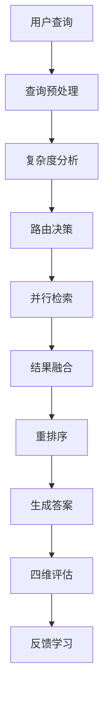

# 技术详细指南

## 目录
- [系统架构](#系统架构)
- [核心组件](#核心组件)
- [数据流程](#数据流程)
- [算法原理](#算法原理)
- [配置详解](#配置详解)
- [扩展开发](#扩展开发)

## 系统架构

### 整体架构图
```
┌─────────────────┐    ┌─────────────────┐    ┌─────────────────┐
│   查询输入层    │    │   路由决策层    │    │   检索执行层    │
│                 │    │                 │    │                 │
│ • 查询预处理    │───▶│ • 复杂度分析    │───▶│ • 混合检索      │
│ • 意图识别      │    │ • 模型选择      │    │ • 向量检索      │
│ • 查询扩展      │    │ • 参数优化      │    │ • 稀疏检索      │
└─────────────────┘    └─────────────────┘    └─────────────────┘
         │                       │                       │
         ▼                       ▼                       ▼
┌─────────────────┐    ┌─────────────────┐    ┌─────────────────┐
│   重排序层      │    │   生成优化层    │    │   评估反馈层    │
│                 │    │                 │    │                 │
│ • 多信号重排    │◀───│ • LangChain生成 │◀───│ • 四维评估      │
│ • 上下文相关    │    │ • 答案优化      │    │ • 持续学习      │
│ • Cohere模型    │    │ • 结果融合      │    │ • 性能监控      │
└─────────────────┘    └─────────────────┘    └─────────────────┘
```

### 技术栈
- **框架**: LangChain 0.2.0+ (LCEL架构)
- **向量数据库**: Chroma, Faiss
- **嵌入模型**: OpenAI text-embedding-ada-002, BGE系列
- **语言模型**: GPT-4, Claude, 本地模型
- **重排序**: Cohere Rerank, NVIDIA NeMo
- **评估**: RAGAS, TruLens
- **缓存**: Redis, 内存缓存
- **监控**: Weights & Biases, TensorBoard

## 核心组件

### 1. 混合检索器 (HybridRetriever)

#### 组件设计
```python
class HybridRetriever:
    def __init__(self):
        self.dense_retriever = VectorStoreRetriever()
        self.sparse_retriever = BM25Retriever()
        self.kg_retriever = KnowledgeGraphRetriever()
        self.fusion_weights = {
            'dense': 0.5,
            'sparse': 0.3,
            'kg': 0.2
        }
```

#### 检索流程
1. **并行检索**: 三个检索器同时执行
2. **结果归一化**: RRF (Reciprocal Rank Fusion) 算法
3. **动态加权**: 基于查询类型调整权重
4. **去重合并**: 基于文档相似度去重

#### 权重调整策略
```python
def adjust_weights(query_type):
    if query_type == "factual":
        return {'dense': 0.6, 'sparse': 0.3, 'kg': 0.1}
    elif query_type == "conceptual":
        return {'dense': 0.4, 'sparse': 0.2, 'kg': 0.4}
    else:
        return {'dense': 0.5, 'sparse': 0.3, 'kg': 0.2}
```

### 2. 加权嵌入融合 (WeightedEmbeddingFusion)

#### 多表征策略
- **原始文档** (权重: 0.6): 保持原始语义
- **摘要表征** (权重: 0.3): 提取核心概念
- **问题生成** (权重: 0.1): 增强检索召回

#### 融合算法
```python
def fuse_embeddings(original_emb, summary_emb, question_emb):
    weights = [0.6, 0.3, 0.1]
    fused = sum(w * emb for w, emb in zip(weights, [original_emb, summary_emb, question_emb]))
    return normalize(fused)
```

### 3. 智能任务路由 (IntelligentTaskRouter)

#### 查询复杂度分析
```python
def analyze_complexity(query):
    factors = {
        'length': len(query.split()),
        'entities': count_entities(query),
        'relations': count_relations(query),
        'ambiguity': calculate_ambiguity(query)
    }
    complexity_score = weighted_sum(factors)
    return classify_complexity(complexity_score)
```

#### 模型选择策略
- **简单查询** (复杂度 < 0.3): 本地小模型 (成本低)
- **中等查询** (0.3 ≤ 复杂度 < 0.7): GPT-3.5-turbo
- **复杂查询** (复杂度 ≥ 0.7): GPT-4 (高质量)

### 4. 四维代理评估 (EnhancedAgenticRAG)

#### 评估维度
1. **相关性 (Relevance)**: 答案与问题的匹配度
2. **完整性 (Completeness)**: 信息覆盖的完整程度
3. **新颖性 (Novelty)**: 提供新见解的能力
4. **权威性 (Authority)**: 来源的可信度和权威性

#### 评估流程
```python
async def four_dimensional_evaluation(query, answer, sources):
    evaluations = await asyncio.gather(
        evaluate_relevance(query, answer),
        evaluate_completeness(query, answer, sources),
        evaluate_novelty(answer, sources),
        evaluate_authority(sources)
    )
    return aggregate_scores(evaluations)
```

## 数据流程

### 文档处理流程
1. **文档摄取**: 多格式支持 (PDF, DOCX, TXT, HTML)
2. **智能分块**: 基于语义边界的分块策略
3. **多表征生成**: 原文、摘要、问题三种表征
4. **嵌入计算**: 批量并行处理
5. **索引构建**: 向量库 + BM25 + 知识图谱

### 查询处理流程


## 算法原理

### RRF (Reciprocal Rank Fusion) 算法
```python
def rrf_score(rank, k=60):
    return 1.0 / (k + rank)

def fusion_rrf(results_list):
    fused_scores = defaultdict(float)
    for results in results_list:
        for rank, doc in enumerate(results):
            fused_scores[doc.id] += rrf_score(rank + 1)
    return sorted(fused_scores.items(), key=lambda x: x[1], reverse=True)
```

### 动态权重调整
基于查询特征的权重自适应调整:
```python
def adaptive_weights(query_features):
    if query_features['has_entities'] > 0.8:
        return increase_kg_weight()
    elif query_features['semantic_complexity'] > 0.7:
        return increase_dense_weight()
    else:
        return default_weights()
```

### 多信号重排序
六个信号维度的重排序策略:
1. **语义相似度**: 0.3权重
2. **关键词匹配**: 0.2权重  
3. **实体覆盖**: 0.2权重
4. **文档质量**: 0.1权重
5. **时效性**: 0.1权重
6. **多样性**: 0.1权重

## 配置详解

### 环境变量配置
```bash
# API密钥
OPENAI_API_KEY=your_openai_api_key
COHERE_API_KEY=your_cohere_api_key
ANTHROPIC_API_KEY=your_anthropic_api_key

# 向量数据库
CHROMA_PERSIST_DIRECTORY=./chroma_db
FAISS_INDEX_PATH=./faiss_index

# 缓存配置
REDIS_URL=redis://localhost:6379
CACHE_TTL=3600

# 模型配置
DEFAULT_EMBEDDING_MODEL=text-embedding-ada-002
DEFAULT_LLM_MODEL=gpt-3.5-turbo
RERANK_MODEL=rerank-multilingual-v2.0
```

### 系统参数配置
```yaml
# config.yaml
retrieval:
  top_k: 10
  similarity_threshold: 0.7
  fusion_weights:
    dense: 0.5
    sparse: 0.3
    kg: 0.2

generation:
  temperature: 0.1
  max_tokens: 1000
  stream: true

evaluation:
  enable_four_dimensional: true
  batch_size: 32
  async_workers: 4

caching:
  enable_memory_cache: true
  enable_redis_cache: true
  cache_size: 1000
```

## 扩展开发

### 自定义检索器
```python
class CustomRetriever(BaseRetriever):
    def __init__(self, custom_params):
        self.params = custom_params
    
    def retrieve(self, query: str) -> List[Document]:
        # 实现自定义检索逻辑
        return documents

# 注册到混合检索器
hybrid_retriever.register_retriever('custom', CustomRetriever())
```

### 自定义评估指标
```python
class CustomEvaluator:
    def evaluate(self, query, answer, context):
        # 实现自定义评估逻辑
        return {
            'custom_metric': score,
            'explanation': explanation
        }

# 添加到评估系统
evaluation_system.add_evaluator('custom', CustomEvaluator())
```

### 插件系统
```python
class RAGPlugin:
    def __init__(self, name):
        self.name = name
    
    def pre_retrieval_hook(self, query):
        # 检索前处理
        return processed_query
    
    def post_generation_hook(self, answer):
        # 生成后处理
        return processed_answer

# 注册插件
plugin_manager.register(MyCustomPlugin('custom_plugin'))
```

### 模型集成指南

#### 添加新的嵌入模型
```python
from langchain.embeddings import BaseEmbeddings

class CustomEmbedding(BaseEmbeddings):
    def embed_documents(self, texts):
        # 实现文档嵌入逻辑
        return embeddings
    
    def embed_query(self, text):
        # 实现查询嵌入逻辑
        return embedding
```

#### 集成新的重排序模型
```python
class CustomReranker:
    def rerank(self, query, documents):
        # 实现重排序逻辑
        scores = self.compute_scores(query, documents)
        return sorted(zip(documents, scores), key=lambda x: x[1], reverse=True)
```

## 性能调优

### 内存优化
- 批量处理嵌入计算
- 延迟加载大型模型
- 定期清理缓存

### GPU 加速
```python
# 启用GPU加速
import torch
device = torch.device('cuda' if torch.cuda.is_available() else 'cpu')

# 批量嵌入计算
def batch_embed_gpu(texts, batch_size=32):
    results = []
    for i in range(0, len(texts), batch_size):
        batch = texts[i:i+batch_size]
        with torch.cuda.amp.autocast():
            embeddings = model.encode(batch)
        results.extend(embeddings)
    return results
```

### 并发优化
```python
import asyncio
from concurrent.futures import ThreadPoolExecutor

async def parallel_retrieval(query):
    loop = asyncio.get_event_loop()
    with ThreadPoolExecutor(max_workers=3) as executor:
        tasks = [
            loop.run_in_executor(executor, dense_retriever.retrieve, query),
            loop.run_in_executor(executor, sparse_retriever.retrieve, query),
            loop.run_in_executor(executor, kg_retriever.retrieve, query)
        ]
        results = await asyncio.gather(*tasks)
    return fusion_results(results)
```

## 故障排除

### 常见问题

1. **检索结果质量低**
   - 检查嵌入模型是否适合领域
   - 调整融合权重参数
   - 优化文档分块策略

2. **生成速度慢**
   - 启用缓存机制
   - 使用GPU加速
   - 优化批处理大小

3. **内存占用高**
   - 减少向量维度
   - 启用模型量化
   - 优化缓存策略

### 调试工具
```python
# 启用详细日志
import logging
logging.basicConfig(level=logging.DEBUG)

# 性能监控
from src.optimization.performance_optimizer import PerformanceProfiler
profiler = PerformanceProfiler()
profiler.start_profiling()
```